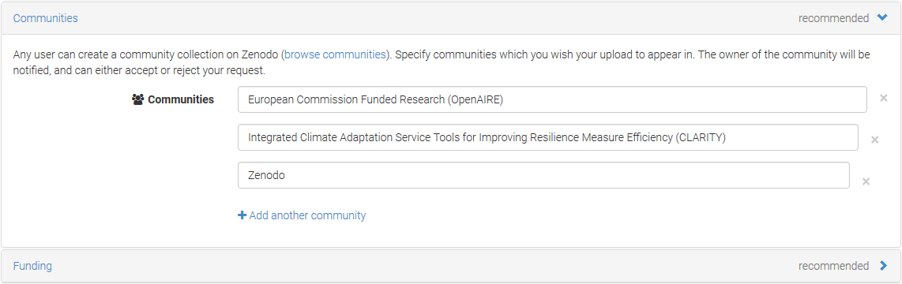

## Catalogue of Data Sources and Simulation Models

The Catalogue of Data Sources and Simulation Models is a meta-data catalogue that makes climate-related information accessible by providing functionalities to streamline publishing, sharing, finding and using data and models. Especially catalogue features like linking data to organisations, software (models) or underlying input data (provenance / lineage) may help to establish trust and confidence in (climate) data and thus to fulfil related Exploitation Requirements. The catalogue can be used for data discovery and meta-data storage by different Climate Services and Building Blocks, respectively. It must be integrated with the Marketplace (7.6) so that data or services offered by Climate Service Suppliers can also be discovered in the catalogue. Moreover, T2.2 "Demonstrator-specific data collection" intends to maintain a catalogue of CLARITY data and metadata that is continuously updated throughout the project in case new data will become available. Thus, it can also be used for the formal documentation (meta-data, linked data, lineage, etc.) of Open Data collected and produced by the project and thus to Data Management activities in T7.3 "Data Management".

### Requested functionality

Baseline requirements elicitation and the assessment of presently available Test Cases have yielded the following functional requirements for this Building Block:

**Baseline functionality**

  - REST web service and RIA frontend

  - usable as source for meta-data harvesting (e.g. datasets could be made accessible through the GEOSS platform following the GEOSS and INSPIRE Data Sharing Principles)

  - acts as OGC CSW or OAI-PMH (Open Archive Initiative – Protocol Metadata Harvesting) endpoint.

  - integration with Marketplace (e.g. meta data in catalogue, actual data available for sale in Marketplace)

  - support public / private (meta-)data and organisations

  - stores machine-readable metadata for spatial extent, temporal extent, resolution, hazards, etc. (including information on uncertainty) to support automated queries to find the right dataset for the right purpose, e.g. input datasets for local hazard models

  - support integration with other compatible metadata catalogues in order to enable cascading searches.

**Functionality requested by CSIS Test Cases**

  - from TC-CSIS-0900: Retrieve metadata records from each dataset that was used in the study (and that is registered in CSIS Data Repository / Catalogue) in order to be included in the Data Package.

  - from TC-CSIS-0031: New (external) data sources that will be added/modified/deleted from the Catalogue of Data Sources and Simulation Models must be managed by this Building Block.

**Functionality requested by DC Test Cases**

  - from TC DC1: When the user is asked by the Scenario Management Building Block to provide the input data needed by the respective (hazard) model, the Catalogue of Data Sources and Simulation Models could be searched and, if suitable data is available for the project area and the respective model, it could be offered to the user.

  - from TC DC1: When the user specifies individual requirements for a hazard map (hazard type, minimal resolution, ...) the Catalogue of Data Sources and Simulation Models could be searched.

  - from TC DC4 010: The Catalogue of Data Sources and Simulation Models is used to get the models and data available in CSIS that could be used in the assessment. The catalogue must offer metadata both for models and datasets and provide the possibility to relate model I/O to datasets.

  - from TC DC4 050: The Catalogue of Data Sources and Simulation Models must offer metadata on element at risk inventories / repositories / atlases that can be used by the Catalogue of Elements at Risk or an external or internal data repository that store the actual element at risk instances.

  - from TC DC4 080: The Catalogue of Data Sources and Simulation Models must provide a list of hazards based on the geographical area selected for a study/scenario.

### Exploitation Requirements assessment

The assessment of the Exploitation Requirements \[11\] identified the following concrete technical and functional implications on this Building Block:

  - from "Establish trust in Climate Services and their providers": Quality assurance and uncertainty of the underlying data and models must be communicated properly throughout the whole planning process. This relates mainly to Scenario Management and a potential Catalogue of Data and Models that must include appropriate meta-information on quality and uncertainties. The data collection and harmonisation activities must take this into account also.

  - from "Establish trust in Climate Services and their providers": Quality assurance must be easily recognizable in the Climate Service Catalogue / Marketplace. Thereby, Climate Service quality could be defined as ability to deliver scientifically sound predictive information that support decision-making under uncertainty.

  - from "Establish trust in Climate Services and their providers": Reputation, neutrality and trustworthiness of a Climate Service provider must be somehow reflected in the Climate Service Provider Profile in the Marketplace. This could include (moderated and verified) feedback from Climate Service users (customer ratings) and links to scientific publications, talks, etc. Moreover, Climate Service Provider Profiles should also be linked to Case Studies that are available in the CSIS (e.g. CLARITY demonstrators) as it for example done in Australia Governmental Marketplace (<https://marketplace.service.gov.au/search/sellers/>).

  - from "Establish trust in Climate Services and their providers": Data Provenance Information including information about the quality of the data, uncertainty, etc. as well as the process (model) which created them must be attached to each dataset. Such Provenance information must be considered in the information model of each element of the overall climate adaptation study workflow. This includes for example also the information model of elements at risk, adaptation options, etc. Therefore, the original information source of the contents of the Catalogue of Elements at Risk and Adaptation Options, other CSIS catalogues, and data stores must be disclosed transparently.

  - from "Establish trust in Climate Services and their providers": a (lightweight) Catalogue of Models and Data Sources (e.g. based on CKAN) is needed in the CSIS in order to be able to link to this Provenance Information. The information model for such a catalogue could be based on CKANs standard meta-information model.

### Technology support

Figure 10 gives an overview on the technological possibilities and the related open-source backend and frontend software components that have been selected for the Technology Support Plan.

Figure 10: Catalogue of Data Sources and Simulation Models Technology Support

**CKAN** is a powerful data management system and the ideal background software for the implementation of the Catalogue of Data Sources and Simulation Models. It is open source software and thus free and highly flexible.

<http://docs.ckan.org/en/latest/user-guide.html>

CKAN provides built-in tools to streamline publishing, sharing, finding and using data and can be extended with plugins like **ckanext-spatial** and **ckanext-geoview** which support spatial metadata and thus allows to perform spatial queries and to display the dataset extent on a map. Such spatial metadata could also be used in the Map Component (5.1) to show availability of relevant datasets (e.g. hazard maps) in the project area.

<https://github.com/ckan/ckanext-geoview>

<https://github.com/ckan/ckanext-spatial>

Moreover, there are official Docker images (<https://hub.docker.com/r/ckan/>) for CKAN available, so it can be directly deployed in CLARITY’s Container Engine and Cloud Infrastructure (7.1). As storage backend, **PostgreSQL** can be used, thus it is compatible to the Integration RDBMS (7.3). CKAN is for example used by the Climate Change Centre AUSTRIA (<http://data.ccca.ac.at>) which published Open Data created by CLARITY partner ZAMG on their Open Data portal (Figure 11).

Figure 11: Climate Change Centre AUSTRIA powered by CKAN

Another usage scenario of CKAN in CLARITY is the formal documentation (meta-data, linked data, lineage, etc.) of Open Data used and produced by the project as required by CLARITY’s Data Management Plan \[9\]. Such a public Open Data catalogue may replace the information on datasets that is currently maintained in CLARITY’s coordination platform ([https://cat.clarityCLARITY-h2020.eu/](https://cat.clarity-h2020.eu/)). Especially CKAN features like linking data to organisations, software (models) or underlying input data (provenance / lineage) may help to establish trust and confidence in (climate) data and thus to fulfil related Exploitation Requirements. There is also the possibility for integrating CLARITY’s CKAN catalogue with external catalogues and external/internal repositories (harvesting), e.g. the **GEOSS** catalogue. Thereby, also metadata on Open Data available from institutional or external repositories and used in CLARITY (e.g. climate intelligence data, model input data) can be included in CLARITY’s metadata catalogue.

Optionally, Open Data (e.g. model output data) generated by CLARITY can be deposited in an institutional or external repository (Figure 12). The respective metadata could then be fed into CLARITY’s Metadata Catalogue and **OpenAIRE**, either manually by Data Managers or automatically if the respective technical infrastructure (e.g. **OAI-PMH** Endpoint) is provided by the repository.

<https://www.openaire.eu/>

**Zenodo**'s OAI-PMH Endpoint could be used by the CLARITY metadata catalogue to harvest (<https://ckan.org/portfolio/federate>) metadata records of the set *user\_CLARITY* (CLARITY community). These records could then in turn be harvested by the GEOSS Registry System (<http://geossregistries.info/>) from CLARITY’s CKAN catalogue.

<https://zenodo.org/>

Figure 12 shows an interesting possibility for a technical approach towards Data Management in CLARITY that aims at integrating CLARITY’s CKAN catalogue with OpenAIRE, Zenodo and external Open Data registries.

Figure 12: A possible approach towards technical Data Management

Open results deposited in Zenodo are automatically assigned a Digital Object Identifier (**DOI**) and will be indexed at **DataCite** (<https://www.datacite.org/>), thus receiving more exposure. Zenodo offers an OAI-PMH Endpoint with supported metadata schema *oai\_dc* (**Dublin Core**). This endpoint is used by OpenAIRE to harvest metadata records belonging to the set *openaire\_data* and to get these records into **CORDIS** (<https://cordis.europa.eu/>) and the **Participants Portal** (<http://ec.europa.eu/research/participants>). Therefore appropriate metadata including the metadata field *grants* (see section 2.1.5 of the CLARITY Data Management Plan \[9\]) must be provided along the open result deposited in Zenodo (Figure 13).

Figure 13: Assigning Grants (CLARITY) with Open Data in Zenodo

Moreover, this OAI-PMH Endpoint could be used by the CLARITY’s Metadata Catalogue (CKAN) to harvest ([https://ckan.org/portfolio/federate/](https://ckan.org/portfolio/federate/)) metadata records of the set *user\_CLARITY* (CLARITY community, Figure 14).

Figure 14: Assigning Communities (CLARITY) with Open Data in Zenodo