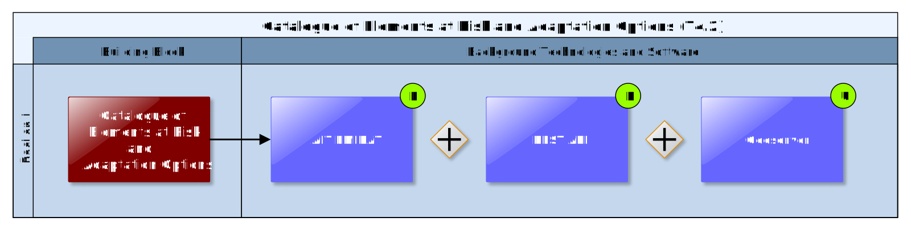

## Catalogue of Elements at Risk and Adaptation Options

The Catalogue of Elements at Risk and Adaptation Options is strongly linked to the EU-GL modules/steps “Characterise Hazard”, “Evaluate Exposure”, “Vulnerability Analysis”, “Assess Risks and Impact” and “Identify Adaptation Options” (see Figure 20) as the actions to be carried out in these steps (except for “Characterise Hazard”) are based on the respective elements at risk types or inventories of elements at risk.

The currently identified elements at risk per demonstration area vary. A more detailed look at the elements at risk per demonstration case is required which will be conducted as one of the next actions. As of now, the Catalogue of Elements at Risk and Adaptation Options is expected to support three distinct scenarios:

1)  **Basic pre-feasibility study**: At this point, only very rough hazard maps are available. Consequently, there is no point in knowing the exact locations of the elements at risk in a project, or even their detailed characteristics. All we need at this level is to indicate which main element at risk types there are in the project (e.g. people, buildings, critical infrastructure, etc.) and roughly estimate the vulnerability of these basic element types to the main hazards that are expected to occur in the project area.

2)  **Advanced pre-feasibility study**\[3\]: At this point, we already have precise hazard maps and therefore need the actual positions of the elements at risk (element at risk inventories) to come up with a better estimate of the involved risks. Wherever possible, the elements at risk used in the project should be associated with more detailed sub-types. As a result, the service will be able to provide improved estimates of the vulnerabilities and of the adaptation options (e.g. their cost and the effect(s) they have on vulnerabilities of elements to different hazards or on their exposure).

3)  The **Expert Services support**: there is a limit to the quality of the information that can be offered by the advanced pre-feasibility study. To reach beyond this limit, the experts must be consulted, e.g. to re-calculate the hazards for specific adaptation and climate scenarios\[4\]. Experts can also be consulted to improve and extend the catalogue of elements at risk and adaptation options with the project-specific entries, or to perform a fully-fledged impact study offline and upload the results to CSIS.

One of the functionalities which are required for the advanced pre-feasibility study and for the expert services support is the import of the site-specific data. Users should be able to upload elements at risk inventories (e.g. inventory of buildings) to a Data Repository (7.4) and/or may purchase already existing datasets in the Marketplace (7.6). Experts should be able to upload the results of their work, e.g. detailed information on elements at risk and adaptation options or project-specific hazards maps\[5\]. One of the challenges will be to identify a generic workflow which nevertheless is specific enough to cater to all user needs. E.g. to best enable users to add/edit/link vulnerability classes to the single elements at risk from a complete element at risk inventory which they upload, two options have been identified:

1)  Enforce a specific data structure (e.g. predefined categories, like vulnerability classes etc.) and format which users must use to upload elements at risk inventories.

2)  Let users upload their data first, and then link the respective columns/fields to the categories (e.g. predefined vulnerability classes) which being used/understood by CSIS.

The functionalities requested by the CSIS- and DC User Stories and Test Cases are described in the next chapter. Current works focus on the understanding of the relationships between elements at risk types/inventories, their vulnerability classes and vulnerability functions, how to best store them and their relationships and how to then calculate exposure, vulnerability, risk and impact.

### Requested functionality

Baseline requirements elicitation and the assessment of presently available Test Cases have yielded the following functional requirements for this Building Block:

**Baseline functionality**

  - The Catalogue of Adaptation Options should offer the users rich and validated sets of known elements at risk types, their vulnerabilities to various hazards and adaptation options.

  - User should be able to define his/her own element at risk, along with the estimates of the vulnerabilities to different hazards and adequate adaptation options. This needs to be saved in the catalogue too, with "reliability of the data" set to low so that the data set is either not shown to other users at all or shown as "low confidence" dataset.

  - Users must be able to also upload an inventory of elements at risk, to add or modify elements and to visualize them on a map.

  - Experts should be able to assess, modify and validate all aspects of the project as a part of the expert workflow. For example, they should be able to validate and/or improve the vulnerabilities of the elements at risk for various hazards. Data that is validated by experts will be marked as “high confidence” in the database and the provenance information stored along with the data.

  - For adaptation scenarios, users should be able to modify the exposure of elements at risk.

**Functionality requested by CSIS Test Cases**

  - from TC-CSIS-0050 Infrastructure Project Management: This Building Block should provide static information on the 4 thematic project options as defined by EU-GL, which are - On-site assets and process types (Element at Risk Types) - Transport links types - project Inputs types - project outputs types and for each of these themes vulnerability functions that provide a concrete vulnerability indicator based on hazard / exposure input.

  - from TC-CSIS-0900 Data Package Export/Download/Forward To: This Building Block should allow to add elements at risk and adaptation options selected for the current project under assessment to a Data Package that can be downloaded by the end user.

**Functionality requested by DC Test Cases**

  - from TC DC1: The Scenario Management Building Block must provide an user interface that will allow the end user to request the creation of alternate adaptation scenarios for scenario comparison in the expert workflow. This request needs to include the type of hazard/impact scenarios object of the simulation and the type of adaptation options to take into account. The supported adaptation options for a specific type of scenario are provided by the Catalogue of Adaptation Options

  - from TC DC1: The Catalogue of Adaptation Options user interface needs to guide the user in the selection of adaptation options to be displayed and compared with the "no adaptation" results (could be a drop-down menu with different adaptation options, e.g. green roofs on 50% of existing buildings, 50% increase vegetative cover on streets, etc. last entry should allow on-demand adaptation measures if the desired one is not available in the list).

  - from TC DC1: The Catalogue of Adaptation Options must provide a user interface to allow the user to request the simulation of a specific adaptation measure that is not yet listed in the Catalogue of Adaptation Options. We are assuming here that simulation scenarios run offline upon request of end users and are retrieved through the Scenario Management Building Block.

  - from TC DC4 040: The user can incorporate new Catalogues of Elements at Risk. Also add or modify elements on an existing one and associate them with an atlas of elements at risk.

  - from TC DC4 050: The user needs to add or modify elements at risk in the Catalogue of Elements at Risk.

  - from TC DC4 070: The user must be able to update and incorporate new Catalogues of Adaptation Options. The catalogue must contain adaptation measures and good practices.

  - from TC RA: The Catalogue of Elements at Risk should offer the possibility to edit an elements at risk feature layer (WFS) in a GUI (e.g. Map Building Block connected to Catalogue of Elements at Risk). This would relate to adaptation scenario and modifying the exposure of elements at risk, respectively.

  - from TC DC4 050: The Catalogue of Elements at Risk will contain the elements at risk available and that can be updated and modified. It must offer an OGC WFS-T interface for interactive editing of elements at risk with help of OGC compliant GUI clients like GeoExt (OpenLayers and ExtJS).

  - from TC-AIT-01: The Catalogue of Elements at Risk and Adaptation Options provides the necessary data on the vulnerability of the elements at risk. If no data is available, the user should be able to define his/her own element at risk, along with the estimates of the vulnerabilities to different hazards. This needs to be saved in the catalogue too, with "reliability of the data" set to low so that the data set is either not shown to other users at all or shown as "low confidence" dataset.

### Exploitation Requirements assessment

The assessment of the Exploitation Requirements \[11\] identified the following concrete technical and functional implications on this Building Block:

  - from "Establish trust in Climate Services and their providers": Data Provenance Information including information about the quality of the data, uncertainty, etc. as well as the process (model) which created them must be attached to each dataset. Such Provenance information must be considered in the information model of each element of the overall climate adaptation study workflow. This includes for example also the information model of elements at risk, adaptation options, etc. Therefore, the original information source of the contents Catalogue of Elements at Risk and Adaptation Options, other CSIS catalogues, and data stores must be disclosed transparently.

  - from "Follow a multi-sectoral approach that crosses the boundary of climate sciences": In order to follow such a multi-sectoral approach, the Catalogue of Elements at Risk and Adaptation Options should provide both a wide range of elements at risk types which are related to many different sectors (e.g. road infrastructure, buildings, social, etc.), as well as a wide range of adaptation options. It might be that not all sectors are fully dealt with at the beginning; therefore, a community-driven mechanism by which the gaps are being filled is suggested. This challenge could be dealt with if the catalogue enables users to provide their own elements at risk types and suggest their own adaptation options, which then might be assessed by experts. Thereby, such user provided content must follow the same quality and transparency standards as being used for essential climate data.

### Technology support

Figure 16 gives an overview on the technological possibilities and the related backend software component that has been selected for the Technology Support Plan.

Figure 9: Catalogue of Elements at Risk and Adaptation Options Technology Support

In CLARITY, the **AIT EMIKAT** will be used for the implementation of the Catalogue of Elements at Risk and Adaptation Options which will be conducted in Task 4.2, as it is also able to provide the requested functionalities as well as the functionalities which are required by the different characteristics of the elements at risk.

The system is capable of handling geo-data (e.g. points, lines, grids, political areas, etc.) which could be especially relevant for the handling of the elements at risk (e.g. points for building locations, lines for roads/transport networks, grids for population densities, etc. The background exists and is usable with minor adaptations.

EMIKAT also manages calculation models for the data in a consistent way. All results can be displayed as graphical results or shapes. Exports/communication can be via WFS or WMS service results (OGC compatible GeoServer data store), REST interface, Shape Files, Excel tables or CSV. The EMIKAT system is fully generic and capable of handling many types of data and models with spatial or temporal properties. This was demonstrated also in the CRISMA project, by using EMIKAT as a software base (<http://crisma-cat.ait.ac.at/model/Population%20exposure%20model>) for the population exposure model calculations and visualisation.

Besides it´s use for the Catalogue of Elements at Risk and Adaptation Options EMIKAT could provide models and data which might be relevant for or offered as an Expert Climate Service: In other projects, EMIKAT is often being used to calculate the state of air quality and the amount of air pollutants / Green-House-Gas-Emissions at certain locations at a given moment of time / period for different adaptation scenarios and then visualize the different results on a map and within an automatically generated report.

For a more detailed description of EMIKAT, please see Annex 1 and the EMIKAT project website [www.emikat.atwww.emikat.at](http://www.emikat.at/).

