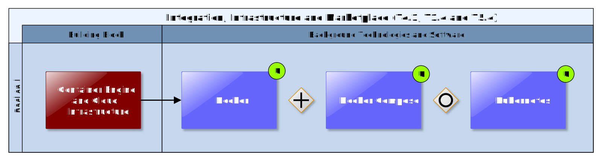

## Container Engine and Cloud Infrastructure

The CSIS is envisioned to be composed of a set of (micro) services that can independently be deployed as isolated containers either on a self-hosted physical server that provides its own container engine or in a virtualized environment offered by a cloud hosting provider. For this purpose, a Container Engine and Cloud Infrastructure Building Block must be part of the CSIS Architecture.

The approach of containerising services makes CSIS developments relatively independent of technological constraints regarding background technology of ICT Services. Accordingly, CLARITY’s technology support team is free to choose whatever technology or software fits best into CSIS Architecture as long as the requirements (functional, exploitation, etc.) are met and interoperability through well-defined APIs and standards is guaranteed.

As stated in D1.1 “Initial workshops and the CLARITY development environment” \[2\], having a micro services architecture for CLARITY CSIS, will allow having heterogeneous technological stacks and different deployment processes. Micro services are appropriate as architecture for CLARITY CSIS purposes and fits very well with a continuous integration platform, indeed it allows having heterogeneous technological stacks and different deployment processes for each software component. It will also bring autonomy on the development process of every consortium partner who will be working on a different CSIS component while having the confidence on not face big issues later on doing the different CSIS components integration.

Accordingly, for most ICT services the CLARITY technology support team will be able to use ready-to-use containers that are available for popular open source solutions like CKAN (3.2.3), PostgeSQL with PostGIS (7.3.2), GeoServer (7.4.3), Drupal 8 (7.5.2) and many more.

### Requested functionality

The Container Engine and Cloud Infrastructure Building Block and the approach described above can provide the following baseline functionality and benefits:

  - Independent developments.

  - Independent deployments.

  - Different software stacks.

  - Fault tolerance.

  - Scalability and re-usability.

  - Ease security monitoring.

  - Business oriented components.

### Exploitation Requirements assessment

The assessment of the Exploitation Requirements \[11\] identified the following concrete technical and functional implications on this Building Block:

  - from "Develop a viable business ecosystem, business model and secure access to funding": Guaranteeing the long-term sustainability of the CSIS, which can be achieved by the provision of a technological infrastructure that ensures maintainability and extensibility beyond the end of the project.

  - from "Develop a viable business ecosystem, business model and secure access to funding": Adopting state of the art cloud and container technologies to be able to transfer the complete CSIS to new hosting environment.

  - from "Develop a viable business ecosystem, business model and secure access to funding": maximising the usage open source software for the implementation of ICT Climate Services to avoid licensing costs.

  - from "Develop a viable business ecosystem, business model and secure access to funding": Minimizing dependencies to software and data that cannot be used after end of the project due to licensing or data protection issues.

### Technology support

Figure 32 gives an overview on the technological possibilities and the related open-source backend software components that have been selected for the Technology Support Plan. Since technology support for this Building Block is provided by T1.4 “Industrialization and Support”, a more detailed description is provided in D1.1 “Initial workshops and the CLARITY development environment” \[8\].

Figure 32: Container Engine and Cloud Infrastructure Technology Support

Regarding containerisation, **Docker** is the choice to achieve having such micro services architecture since Docker container engine is able to encapsulate lightweight runtime environments and provide good portability, performance, ease of replication, environment isolation, high availability and scalability as some of its main features.

<https://en.wikipedia.org/wiki/Docker_(software)>

To coordinate, monitor and manage such container infrastructure an automation technology is highly recommendable. **Docker Compose** seems to be appropriate as first approach because its simplicity but depending on the project needs it may change to **Kubernetes**.

<https://kubernetes.io/docs/concepts/overview/what-is-kubernetes/>

This kind of tools are able to provisioning hosts, instantiating a set of containers, link containers, expose services and scale the container cluster.

About the underlying hardware infrastructure there are two approaches under consideration:

  - **Local server**  
    CLARITY partners ATOS or AIT can provide a dedicated development and deployment server (64 GB RAM, 8 cores, 8 TB hard drive) where the tools will be available for automatizing the different CSIS components’ code compilation, testing, and integration. Initially this is the option to be used unless project development requires a more powerful infrastructure.

  - **European Grid Infrastructure (EGI)**  
    EGI is a foundation providing access to computing services across Europe by using grid computing techniques. It links computing centres in different European countries to support international research activities in different disciplines. EGI offers to deploy and scale Docker containers on demand (<https://www.egi.eu/services/cloud-container/>), offering guaranteed computational resources in a secure and isolated environment with standard API access, without overhead of managing the operative system for an improved performance, ideal for development work. This option fits well with technical CLARITY ideas so it can be further explored if it is finally needed.

<https://www.egi.eu/about/>