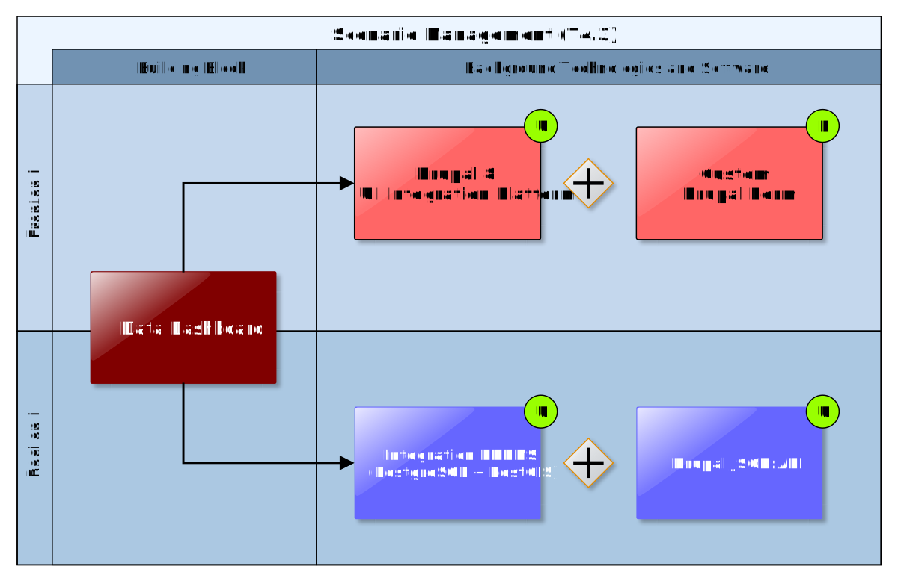
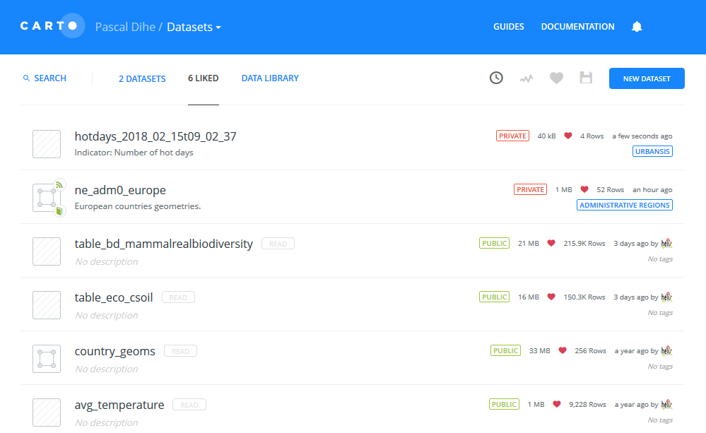

## Data Dashboard

The Data Dashboard Building Block provides an overview of all the different datasets that are used, produced, ordered, collected, requested, exchanged etc. by an end user (e.g. project planner or climate resilience manager) during an assessment (planning session). Thereby, it reports also on the usage of datasets obtained or available from supply-driven Downstream Climate (Data) Services. Datasets are organised (e.g. in a folder-like structure) according to their relation to the modules of the EU-GL (e.g. hazard maps, impact scenario results, elements of risk inventory). From the dashboard, the user has access to different dataset-type-specific tools that are realised as separate ICT Climate Services integrated into the CSIS. These tools correspond to Building Blocks or external tools and provide for example map visualisation (5.1), data analysis and comparison (5), Data Package download (4.2) and Marketplace functionality (7.6).

### Requested functionality

Baseline requirements elicitation and the assessment of presently available Test Cases have yielded the following functional requirements for this Building Block:

**Baseline functionality**

  - provides an overview of all the different datasets that are used, produced, ordered, collected, requested, exchanged, etc. by an end user in the user’s project workspace

  - integrates with different (also external) (meta)data catalogues

  - can show the origin (provenance) of each dataset

  - integrates different tools (ICT Climate Services) that can be used to visualise the data or to perform operations on the datasets

  - supports the CLARITY Data Package Standard (cf. section 4.2.3) for easy import and export of datasets with help of the Data Package Export Tools

  - provides “deep links” to external Climate (Data) Services (e.g. SWICCA), so that the end user can explore, process, view, export the dataset in the original system

  - Allows, via a UI, to upload new datasets (or remove them) or find them using the metadata catalogue

**Functionality requested by DC Test Cases**

  - from [TC-CSIS-0900](http://cat.clarity-h2020.eu/node/854/): The Data Dashboard shows the origin (from expert study, from public data catalogue, from external climate data service), the status (ordered, available, self-provided, …) and the purpose (input for Hazard, Exposure, Vulnerability, input and output of Risk Assessment and Impact / Adaptation Scenario Analysis,) and related metadata (expert opinion, inspire metadata, provenance metadata, uncertML, etc.).

  - from [TC RA](http://cat.clarity-h2020.eu/node/873/): The Data Dashboard is a Building Block that provides an easy overview of the results for the user.

### Exploitation Requirements assessment

The assessment of the Exploitation Requirements \[11\] identified the following concrete technical and functional implications on this Building Block:

  - from "Demonstrate and communicate the (co-)benefits of Climate Services": Expert Climate Services by external stakeholders should be easily integrated with generic ICT Services of the CSIS through a "data-driven" architecture.

  - from "Demonstrate and communicate the (co-)benefits of Climate Services": There is a strong need for an (meta-) information model for case studies (CLARITY Demonstration Cases) that is linked with the information models for Climate Services (Marketplace offer) and their providers (Service Portfolio) and through indirection also with climate data and models, tools (provenance). This allows also for demonstrating the benefits of Upstream Climate Services (e.g. Copernicus C3S) by means of Case Studies (e.g. CLARITY Demonstration Cases).

### Technology support

Figure 16 gives an overview on the technological possibilities and the related open-source frontend and backend software components that have been selected for the Technology Support Plan.

Figure 16: Data Dashboard Technology Support

Technically, the Data Dashboard is a user interface component that is embedded into the Scenario Management component (4.3) and thus the User Interface Integration Platform (7.5), respectively. According to this and in relation to the integration concept described in section 7.5.2, there are two possibilities for providing technology support for the frontend part (Figure 16) of this Building Block:

1)  As independent HTML5/AJAX **RIA** that is loosely embedded as HTML5 **iframe** and communicates with the backend of the UI Integration Platform (Drupal) via a REST API exposed by the Integration RDMBS (**cids Integration base** and **PostgreSQL /** **PostGIS**, respectively); or

2)  as dedicated **Drupal Form or Module (PHP)** that is tightly coupled to the UI Integration Platform.

<http://uwe.pst.ifi.lmu.de/publications/maewa_rias_report.pdf>

The general advantages and disadvantages of both approaches are described in detail in section 7.5.2. Concerning the Data Dashboard Building Block, the **RIA**-based approach offers more flexibility regarding the actual user interface design and the presentation and organisation of the different datasets.

<http://uwe.pst.ifi.lmu.de/publications/maewa_rias_report.pdf>

Also integration with the internal Catalogue of Elements at Risk and Adaptation Options (3.1) and the Catalogue of Data Sources (3.2), external Catalogues like GEOSS (<http://www.geoportal.org/>), (Climate) Data Services like the C3S Climate Data Store (<https://climate.copernicus.eu/climate-data-store>) or the climate data factory (<https://theclimatedatafactory.com/>) that offer a public **RESTful API** is easier to accomplish due to the inherent support for REST and **AJAX** in RIAs.

<https://www.drupal.org/docs/user_guide/en/understanding-modules.html>

Although the rich functionality offered to a **Drupal Module** by the powerful **Drupal API** (<https://www.drupal.org/docs/8/api>) is not available when following the RIA-based approach, AJAX applications can benefit from a tremendous amount of ready-to-use solutions (packages, modules, libraries) developed by the world-wide open-source community and made available through popular registries like npm (<https://www.npmjs.com/>) or Yarn (<https://yarnpkg.com/>).

<https://www.drupal.org/docs/8/api/form-api/>

Still, there is the need for “bootstrapping” an **Angular** or **React** RIA by assembling, integrating, configuring and possibly also adapting the most suitable open-source source libraries.

<https://angular.io/docs>

<https://github.com/facebook/react/>

To speed up this process, it would be beneficial to base the development of the Data Dashboard on an existing RIA that offers already much of the functionally of such a dashboard. A possibly open source solution that could be used for such a purpose is **CartoDB**.

Figure 17 shows an example of the CartoDB Dataset dashboard that has been configured with public data linked from the HELIX FP7 project’s Helix Scope CartoDB application (<https://helixscope-app.herokuapp.com/>) and data imported from UrbanSIS (<http://urbansis.climate.copernicus.eu/>), among others. As this dataset dashboard represents only a fraction of functionality offered, the CartoDB software suite could also be interesting for the Data Repository (7.4) and the Map Component Building Block (5.1).

<https://cartodb.readthedocs.io/en/latest/intro.html>

The main disadvantage of the CartoDB-based approach is, that out-of-the box CartoDB supports only a limited set of geospatial data formats like Shapefile, Keyhole Markup Language (KML), GeoJSON, CSV, Spreadsheets (Excel or OpenDocument), GPS Exchange Format (GPX) and their own CARTO data format. Therefore and among others, to be able to fulfil the requirements of CLARITY Building Blocks (like support for the NetCDF files), CartoDB cannot be used “as is”, most likely many changes to the huge and complex open source codebase of CartoDB (<https://github.com/CartoDB/cartodb>) would be necessary. In consequence, the first prototype of the Data Dashboard will be devolved as Drupal Form and Drupal Module, respectively. Since Drupal Forms that use the Drupal Form API can also trigger AJAX responses, integration with other RESTful web services (external data catalogues and repositories) is possible, too. Therefore, the backend of the Data Dashboard is the same for either fronted approach.

Figure 17: CARTO Data Dashboard (Example)