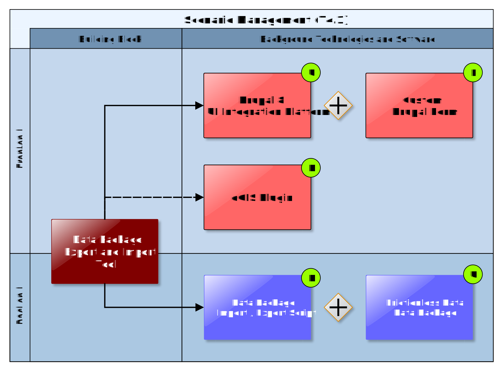
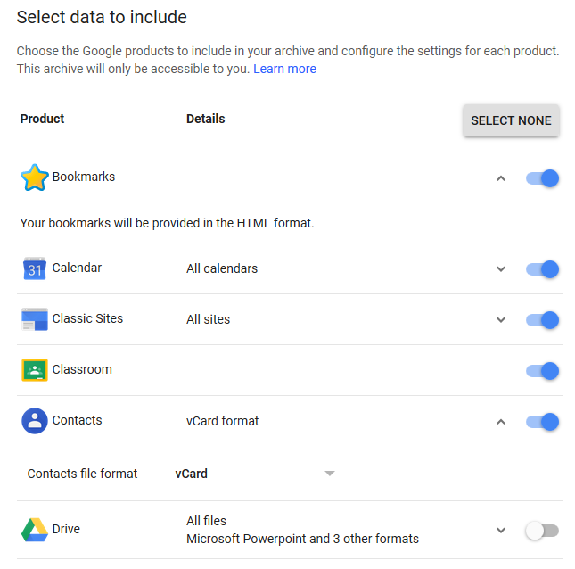

## Data Package Export and Import Tool

The Data Package Export and Import Building Block is a tool that can used at any stage of the adaptation planning process to export (download) any data that is directly available in the CSIS (e.g. stored in a Data Repository, see section 7.4) in standardised format, the CLARITY Data Package.

Information produced by CLARITY Climate Services must be provided in a common Data Package that accompanies the text-based report (document with text, graphs, maps, etc.) that is (semi-)automatically generated by the Report Generation Tool (6.2) at the end of the adaptation planning process. This Data Package should contain all data used to generate the contents of such a report so it can be (re)used later on in further stages. For example, a climate expert hired to further carry out local assessment of the climate impact should import the information from CLARITY Data Package and use it for his/her own analyses. Later on, he/she must generate a similar package that then can be imported in CLARITY CSIS.

Technically, a standardised Data Package can be realised as “distributed data object“, so that not all data must reside in the same location (database, server). Here arises also the need for “Smart Links” (Scenario Transferability, see section 5.2) that can combine, relate and describe different information entities (in this particular case the distinct elements of Data Package). Furthermore, a serialisation feature for Data Packages is needed that allows to put all contents of package into a concrete (zip) file that can be shared, e.g. with other experts. The output of Climate Services must be delivered as such a Standardised Data Package to ensure technical interoperability to the CSIS and thus the Climate Services Ecosystem. Consequently, a Data Package can either reside on the CSIS as Virtual Data Package (distributed among several physical data stores) if the provider of the Expert Climate Service uses the CLARITY CSIS to provide its service, or as concrete file (Serialized Data Package) if the provider works offline.

### Requested functionality

Baseline requirements elicitation and the assessment of presently available Test Cases have yielded the following functional requirements for this Building Block:

**Baseline functionality**

  - CLARITY Data Package specification: The specification describes which standards are accepted/used to encode the information as well as metadata to be included.

  - software (with a defined and exposed API) that allows writing and reading data from CLARITY Data Package

**Functionality requested by CSIS Test Cases**

  - from TC-CSIS-0900: The tool should offer a GUI like a data dashboard (as separate Building Block or as part of the Data Package Building Block) that shows the origin (from expert study, from public data catalogue, from external climate data service), the status (ordered, available, self-provided, ...) and purpose (input for H, E, V, RA Impact Scenario Analysis, output of RA or impact/ adaptation scenario analysis) and allows to select the data for inclusion the data and related metadata (expert opinion, inspire metadata, provenance metadata, uncertML, .... etc.) package export ("download zip file").

### Exploitation Requirements assessment

The assessment of the Exploitation Requirements \[11\] identified the following concrete technical and functional implications on this Building Block:

  - from "Demonstrate and communicate the (co-)benefits of Climate Services": Expert Climate Services by external stakeholders should be easily integrated with generic ICT Services of the CSIS through a "data-driven" architecture. Thereby, data standards are important. This relates to the definition of standardised “Data Packages” which include the results of a complete climate adaptation study in standardised format.

  - from “Consider the role of new regulatory frameworks in stimulating the emergence of Climate Services": All datasets included in the Data Package that are provided together with the accompanying report document must enclose the corresponding metadata records so that external parties are aware of who, when, how (including information about the uncertainty) and for what purpose the data was produced.

  - from "Use, define and promote open standards for data and services": A standardised Data Package “provides a simple contract for data interoperability that supports frictionless delivery, installation and management of data.” (<http://frictionlessdata.io/data-packages/>). It is a general container format for climate risk adaptation studies that is based on the CLARITY Modelling Methodology, best practices, data standards and state-of-the art ICT technologies. As starting point, a simple directory layout that follows the CLARITY Modelling Methodology (adapted EU-GL modules) and defines the format and details of contained (model I/O) data as it is done for example by CMIP5 - Data Description (<https://cmip.llnl.gov/cmip5/output_req.htm>l). Then, the Data Package Standard will evolve during the course of the project (agile approach).

### Technology support

Figure 18 gives an overview on the technological possibilities and the related open-source frontend and backend software components that have been selected for the Technology Support Plan.

Figure 18: Data Package Export and Import Tool Technology Support

Regarding the fronted part of the Data Package Export and Import Tool, the same options as for the Data Dashboard Technology Support Plan (4.1.3) apply. The user interface could be similar to the Google Takeout Tool (<https://takeout.google.com/settings/takeout>) that is shown in Figure 19.

Figure 19: Google Takeout Data Export Tool (Example)

Similar to the Takeout Tool, which collects the information from different Google Services, the Data Package Tool must collect and possibly covert the user’s data stored in the Integration RDBMS (7.3) and the Data Repository (7.4). This task corresponds to the serialisation feature mentioned previously and is accomplished by a server-side script that is invoked by the Data Package frontend via a **RESTful API**. The interoperability standards for serialising the CLARITY Data Package are based on **OGC’s GeoPackage** and **Frictionless Data’s Data Package** standards.

As described in OGC Network™ (<http://www.ogcnetwork.net/>), a GeoPackage \[12\] is a universal open file format for geo-data provided by Open Geospatial Consortium (OGC).

<http://www.geopackage.org/spec/>

It is standards-based, application and platform independent and self-describing to increase the cross-platform interoperability of geospatial applications and web services. It is designed to facilitate widespread adoption and use of a single and simple file format by open-source software applications. Since it is built on top of **SQLite**, it can be accessed through SQL standard, giving all performance of a spatial database along with the convenience of a single file-based data set that can be easily shared.

<https://www.sqlite.org/about.html>

An OGC Data Package is able to store:

  - vector features

  - tile matrix sets of imagery and raster maps at various scales

  - attributes (non-spatial data)

  - extensions

It could be useful to manage vector data to avoid ESRI **Shapefile** limitations and can be manipulated by OpenGIS Simple Features Reference Implementation (**OGR**) and Geospatial Data Abstraction (**GDAL**) libraries. Its major downside is that the underlying SQLite database is a complex binary format that is not suitable for streaming. It either must be written to the local file system or accessed through an intermediary service like **GeoServer**, one of the Data Repository technologies (see 7.4.3) selected for CLARITY.

A complementary approach is to use Data Packages, as described by **Frictionless Data**, is a simple container format for arbitrary data files.

<https://frictionlessdata.io/data-packages/>

It could be useful to include metadata and point to local or remote files including also OGC Data Package files as well as raster images, NetCDF files and Indicator Data resulting from (impact and adaptation) scenario analysis (see 4.1.3).

It currently offers two complexity levels:

**Data Package specification**, a simple format for packaging data for sharing between tools and people.

  - Readme file

  - Data Package, a JSON file used as general metadata and resource index

  - Data files, for alphanumeric data this model uses CSV files.

**Tabular Data Package**, a format to package tabular data that builds on Data Package but additionally it uses:

  - Table Schema, a specification to define a schema for tabular data. This means a JSON file describing data fields, description and data types.

  - CSV Dialect Description Format, a JSON file where to specify and define a dialect for CSV data.

This simple format can be extended by additional CLARITY JSON metadata files that are recognized by the different Building Blocks and ICT Climate Service developed by CLARITY.