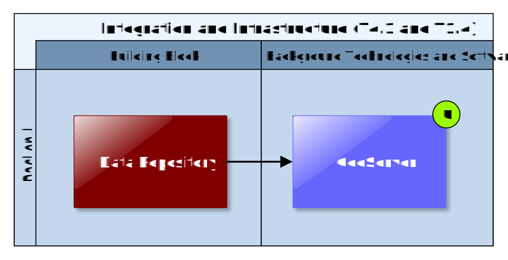

## Data Repository

This Building Block represents a set of generic data repositories that can be used to store, manage, and retrieve different types of (file based) datasets. Among others, this Building Block is used to facilitate the sharing of datasets between users and providers of Climate Services. Different types of data repositories can be used to easily serve data in standards compliant way so that other Building Blocks and Climate Services may use them for further processing like viewing (e.g. Map Component Building Block, see 5.1) or editing. Information about the actual datasets that are managed in different data repositories can be stored in a dedicated metadata catalogue (3.2) to facilitate discoverability and dissemination of data.

### Requested functionality

Baseline requirements elicitation and the assessment of presently available Test Cases have yielded the following functional requirements for this Building Block:

**Baseline functionality**

  - store and manage all types of "data" (file based cloud storage)

  - access control (if we need to store confidential or sensitive demonstrator specific data or "paid" data)

  - facilitate sharing of data between users and providers of Climate Services (store and retrieve data related to "Expert Studies")

  - standards-based data access protocols (HTTP, WMS, OpenDAP, ....)

**Functionality requested by CSIS Test Cases**

  - from TC-CSIS-0900: Data generated on each step of the pre-feasibility study (e.g, RA-Hazard, Impact, Vulnerability maps, etc.) should be registered in the data repository (e.g., GeoServer). References (URLs) to these datasets will be added to the Data Package descriptor.

**Functionality requested by DC Test Cases**

  - from TC DC1: The simulation scenario results (indicators and maps) generated by the expert during offline simulations must be uploaded to the Data Repository so that it is accessible for Scenario Analysis and MCDA. This includes Indicators and spatial data. Spatial data uploaded to the data repository should be made available as WMS layer so that it can be shown in the Map View Building Block. If requested by the user, also the "raw model output" could be uploaded by the expert (e.g. for further offline analysis or validation by the end user)

  - from TC RA: To retrieve the exiting hazard map, links to the hazard maps could point directly to the files or to layers in a Geoserver service (Data Repository).

  - from TC DC4 010: The climate broker (CS Provider) makes data available requested by the end user (e.g. local hazard data generated by a micro climate model) through the Data Repository.

  - from TC DC4 050: The Data Repository will contain the elements at risk available. It may offers a standards-based OGC WFS-T interface that can be used to update and modify and the attributes and spatial extent of elements at risk which are represented as GML features.

### Exploitation Requirements assessment

The assessment of the Exploitation Requirements \[11\] identified the following concrete technical and functional implications on this Building Block:

  - from "Offer free basic Climate Services based on free and Open Data": Technology support must provide Data Repositories that are not only able to store several Gigabytes of climate data but also provide standardised machine-level access (OpenDAP, WMS) to other ICT services and (impact) models. In order to reduce the storage capacity, a service data-broker may be used; this service would offer access to data stored by servers external to CSIS in an easy and transparent way for the user.

  - from "Demonstrate and communicate the (co-)benefits of Climate Services": ICT Climate Services must produce tangible outputs for end users, e.g. reports and data in standard formats like SHP, NetCDF, PDF, ODF, etc.

  - from "Co-design Climate Services engaging a community of users, providers, purveyors and researchers": allow external stakeholders participating in co-design of Expert Climate Services to easily request and exchange information needed to perform a climate adaptation study. This includes for example secure cloud storage facilities that are suitable for exchanging confidential and private data.

  - from "Offer commercial fit-for-purpose tailored services targeting specific sectors and user groups": Easy technical facilities for external service providers to develop their Climate Services according to CLARITY conceptual and technical standards must be offered. This includes for example convenient data (e.g. study results and model outputs) upload facilities that enable Climate Service providers that deliver their result in the standardised data formats recognized by CLARITY.

  - from "Offer commercial fit-for-purpose tailored services targeting specific sectors and user groups": Data repositories (Thredds, GeoServer, etc.) for secured and controlled access must be provided and technically integrated into the CSIS Infrastructure. Thereby, data protection is an important issue as such data exchanged between providers of paid Expert Services and the users of such services will in most cases not be made public, so secured access to the data repositories must be ensured.

### Technology support

Figure 37 gives an overview on the technological possibilities and the related open-source backend software components that have been selected for the Technology Support Plan.

Figure 37: Data Repository Technology Support

The CLARITY Data Management Plan \[9\] and the demonstrator specific data collection in D2.1 “Demonstration and Validation Methodology” \[14\] identified the following major data formats that are relevant for CLARITY Climate Services and that should be made accessible in a standards-compliant way:

  - **Network Common Data Form (NetCDF)**  
    NetCDF is an abstraction that supports a view of data as a collection of self-describing, portable objects that can be accessed through a simple interface. Array values may be accessed directly, without knowing details of how the data are stored. Auxiliary information about the data, such as what units are used, may be stored with the data. Generic utilities and application programs can access netCDF datasets and transform, combine, analyse, or display specified fields of the data. The development of such applications has led to improved accessibility of data and improved re-usability of software for array-oriented data management, analysis, and display.  
    <https://www.unidata.ucar.edu/software/netcdf/docs/netcdf_introduction.html>

  - **ESRI Shapefile (SHP)**  
    A shapefile stores -nontopological geometry and attribute information for the spatial features in a data set. The geometry for a feature is stored as a shape comprising a set of vector coordinates.  
    <https://www.esri.com/library/whitepapers/pdfs/shapefile.pdf>

  - **Enhanced Compression Wavelet (ECW)  
    **ECW is a proprietary wavelet compression image format optimized for aerial and satellite imagery. It was developed by Earth Resource Mapping, and is now owned by Intergraph part of Hexagon AB. The lossy compression format efficiently compresses very large images with fine alternating contrast while retaining their visual quality.  
    <https://en.wikipedia.org/wiki/ECW_(file_format)>

  - **Geographic Tagged Image File Format (GeoTIFF)**  
    GeoTIFF is a public domain metadata standard which allows georeferencing information to be embedded within a TIFF file. The potential additional information includes map projection, coordinate systems, ellipsoids, datums, and everything else necessary to establish the exact spatial reference for the file. The GeoTIFF format is fully compliant with TIFF 6.0, so software incapable of reading and interpreting the specialized metadata will still be able to open a GeoTIFF format file.  
    <https://en.wikipedia.org/wiki/GeoTIFF>

With respect to the data integration approach of the SUDPLAN Scenario Management System described in Annex 1 and Technology Support Plan of the Map Component Building (5.1.2), datasets available in the aforementioned raster and vector data formats will be made available via OGC service interfaces. These standardised interfaces are mainly:

  - **Web Feature Service (WFS)  
    **The Web Feature Service (WFS) represents a change in the way geographic information is created, modified and exchanged on the Internet. Rather than sharing geographic information at the file level using File Transfer Protocol (FTP), for example, the WFS offers direct fine-grained access to geographic information at the feature and feature property level.  
    <http://docs.opengeospatial.org/is/09-025r2/09-025r2.html>

  - **Web Map Service Interface (WMS)**  
    The OpenGIS® Web Map Service Interface Standard (WMS) provides a simple HTTP interface for requesting geo-registered map images from one or more distributed geospatial databases. A WMS request defines the geographic layer(s) and area of interest to be processed. The response to the request is one or more geo-registered map images (returned as JPEG, PNG, etc) that can be displayed in a browser application.  
    <http://www.opengeospatial.org/standards/wms>

  - **Web Map Tile Service (WMTS)**  
    A WMTS enabled server application can serve map tiles of spatially referenced data using tile images with predefined content, extent, and resolution.  
    [http://www.opengeospatial.org/standards/wmtshttp://www.opengeospatial.org/standards/wmts](http://www.opengeospatial.org/standards/wmts)

Several free and open source solutions available implement (no only) the respective OGC standards and support the different data formats commonly used and produced by Climate Service. For CLARITY, the popular products **GeoServer** and **ERDAPP** have been selected.

<http://geoserver.org/>

<http://coastwatch.pfeg.noaa.gov/erddap/information.html>