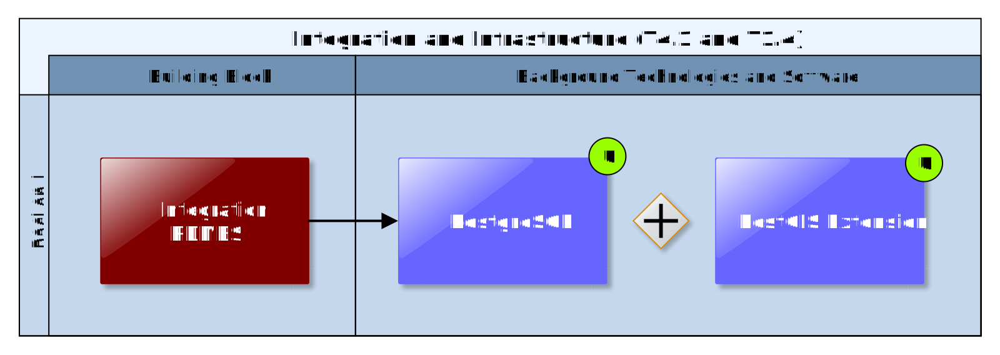
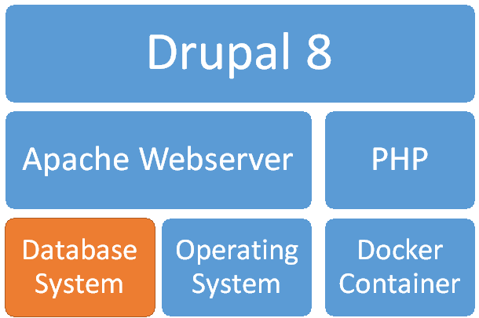
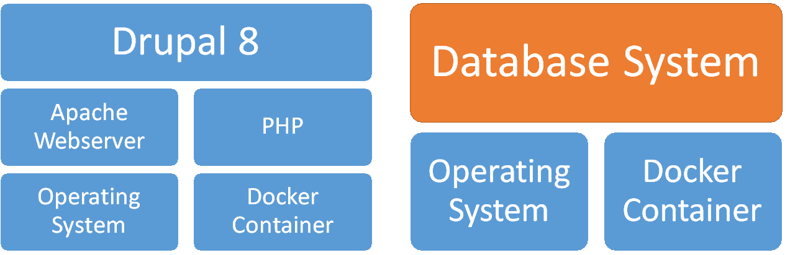

## Integration RDMBS

The Integration RDMBS is the central relational database management system for management and integration of common and shared information stored as relations (in tabular form). It is used as the storage back end of the UI Integration Platform (7.5) and the Scenario Management Building Block (4.3) and stores, among others, the individual infrastructure project configurations and the associated assessment and adaptation planning information created by end users. Thereby, it is important to highlight, that the actual datasets generated during the EU-GL/CLARITY adaptation planning process (hazards maps, model outputs, ...) are not stored in this Integration RDMBS but in general in a separate Data Repository (7.4). The Integration RDBMS Building Block may offer several different databases, each suitable for a different purpose. Therefore, also other Building Blocks that are not directly related to UI Integration Platform, the like Marketplace (7.6) for example, may use the RDMBS as storage back end for their relational data. This allows for easy sharing of common data without the need to introduce additional Building Blocks or APIs.

### Requested functionality

Baseline requirements elicitation and the assessment of presently available Test Cases have yielded the following functional requirements for this Building Block:

**Baseline functionality**

In addition to the common features of a modern Relational Database Management System (e.g. provide relational operators to manipulate the data in tabular form, replication, security, ...), the Integration RDMBS must support storing, processing and querying of spatial data.

**Functionality requested by CSIS Test Cases**

  - from TC-CSIS-0050: The Integration RDMBS BB exposes a REST API towards the user workspace and the Project Master Data databases and provides the following functionalities: get Project Instance from User Workspace, update Project Instance in User Workspace, create Project Option Instances in User Workspace, get Project Option Types for Project Type from Project Master Data, add new Project Option Type to Project Master Data (Project Option Types).

  - from TC-CSIS-0060: Static (project types, project option types, sector types, ...) project information as well as concrete instances of projects created by end users (workspace) are stored in this RDMBS.

  - from TC-CSIS-0065: Provider Profiles and Portfolios should be stored and managed by this Building Block. It is realised by the PostgreSQL RDBMS database backend of the UI Integration Platform (Drupal) and possibly also the Marketplace Building Block.

  - from TC-CSIS-0900: Retrieve information concerning the current project being assessed (e.g. project type) that will be also included in the Data Package.

**Functionality requested by DC Test Cases**

  - from TC DC2 P1 : Database that connect projects to elements at risks, hazards and information in specific datasets.

### Technology support

Figure 34 gives an overview on the technological possibilities and the related open-source backend software components that have been selected for the Technology Support Plan.

Figure 34: Integration RDMBS Technology Support

**PostgreSQL**, one of the most widely used RDMBS, has been selected as the actual implementation of the Integration RDMBS.

<https://www.postgresql.org/about/>

As open-source software, it can not only be used free of charge, it is also the default RDBMS of the **cids Integration Base** (4.3.3) and a supported database backend of **Drupal 8** (UI Integration Platform). Moreover, in combination with the **PostGIS** extensions it supports storage of spatial data and numerous spatial operations including spatial queries.

<https://postgis.net/>

Since a relational database management system is per definition generic, no adaptation or development activities are needed apart from the design and specification of individual data models. The data models, especially the cids integration base DDL can be easily extended as needed. Moreover, the ability to implement **stored database procedures** opens wide possibilities for further extensions, e.g. to develop (simple) impact models directly on the level of the RDMBS.

CLARITY partner CIS provides a custom **PostgreSQL 9.x+ PostGIS 2.x Docker image** (<https://hub.docker.com/r/cismet/cids-integration-base/>) that automatically creates a new cids Integration Base on basis of the *cids-init* database schema DDL. Alternatively, the **mdillon/postgis** Docker image (<https://hub.docker.com/r/mdillon/postgis/>) that is based on the official PostgreSQL Docker image (<https://hub.docker.com/_/postgres/>) can be used to initialize an empty PostgreSQL RDBMS Docker container and to create the cids Integration Base database with help of the cids-init script afterwards.

Figure 35: Containerised Drupal System

In addition, there is also an official Docker image for **Drupal 8** available (<https://hub.docker.com/_/drupal/>), so that an entire Drupal system can be containerised (Figure 35) with help of the Container Engine and Cloud Infrastructure Building Block (7.1). Moreover, thanks to the availability of separate Docker images for the Integration RDMBS, separate containers for frontend and backend can be instantiated as shown in Figure 36. This facilitates the usage of the CLARTIAY Drupal system’s database backend in a different contexts, e.g. for the provision of an additional **RESTful APIs** as explained in the Technology Support Plan of the Scenario Management System (4.3.3).

Figure 36: Role of Integration RDMBS in Drupal Architecture