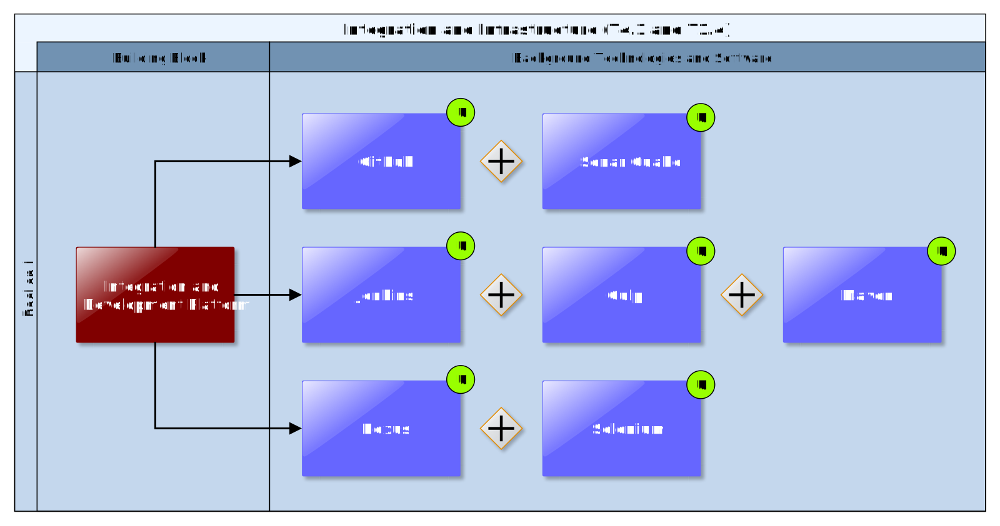

## Integration and Development Platform

As described in D1.1 “Initial workshops and the CLARITY development environment” \[2\], the purpose of this Building Bock is to provide a continuous integration platform allowing every consortium partner to be equipped with the tools and measures for best practices in software engineering. One of the most important factors on a successful IT project is to develop high quality software. Thereby, an appropriate development infrastructure and best practices are crucial in development in a distributed environment.

"Continuous integration is a software engineering practice in which isolated changes are immediately tested and reported on when they are added to a larger code base. The goal of CI is to provide quick feedback so that if a defect is introduced into the code base, it can be identified and corrected as soon as possible. Continuous integration software tools can be used to automate the testing and build a document trail." \[13\]

### Requested functionality

Baseline requirements elicitation has yielded the following functional requirements for this Building Block:

  - support the development of industrial-quality code

  - provide a consistent development toolset for
    
      - source code management
    
      - dependencies management
    
      - build automation
    
      - automated testing
    
      - continuous integration
    
      - release management

### Exploitation Requirements assessment

The assessment of the Exploitation Requirements \[11\] identified the following concrete technical and functional implications on this Building Block:

  - from "Develop a viable business ecosystem, business model and secure access to funding": provision of a development environment and continuous integration system that eases common software maintenance tasks, e.g. bug fixes.

### Technology support

Figure 33 gives an overview on the technological possibilities and the related open-source frontend and backend software components that have been selected for the Technology Support Plan. Since technology support for this Building Block is provided by T1.4 “Industrialization and Support”, a more detailed description is provided in D1.1 “Initial workshops and the CLARITY development environment” \[8\].

Figure 33: Integration and Development Platform Technology Support

The technology stack of the Integration and Development Platform is briefly described below. The platform itself is realised by means of different **Docker** containers hosted in the CLARITY Container Engine and Cloud Infrastructure (7.1).

<https://github.com/>

<https://jenkins.io/>

<https://www.sonatype.com/nexus-repository-oss>

<https://www.sonarqube.org/>

<https://www.seleniumhq.org/projects/grid>

<https://gulpjs.com/>

<https://maven.apache.org/>