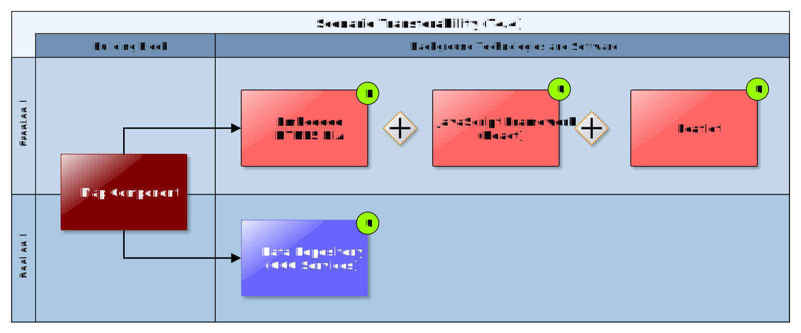
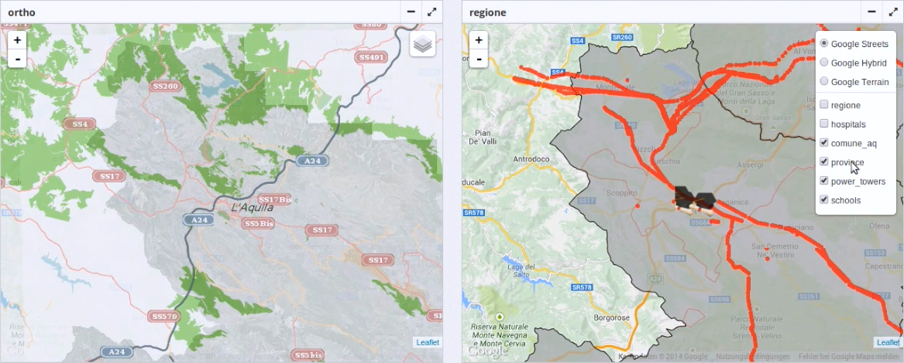

## Map Component

The Map Component is understood as a reusable, flexible and highly configurable Building Block meant to be used throughout CSIS. It is envisioned as an embeddable component that can be easily adapted to different parts of the common CSIS UI. The core functionalities of this component must be a clear and easy visualization of different maps and layers. It is also a key feature of the map component to allow for a degree of interactivity meant to enable users to better define locations, elements at risk, hazards, scenario results, etc.

### Requested functionality

Baseline requirements elicitation and the assessment of presently available Test Cases have yielded the following functional requirements for this Building Block:

**Baseline functionality**

  - Basic map functionality such as zoon in, zoom out, pan, click on a point (and get info related to it if available), draw polygon/bbox, etc.

  - Visualize different types of hazard maps in relation to climate change projections for an area of interest

  - Advanced layer management: the user must be able to add individual (hazards) maps as layers (e.g. from existing (local) WMS), and to provide a set predefined climate change projection layers (e.g. from C3S.)

  - Support for Map Layer Timeline, e.g. visualize temperature change between 2020-2050 in an area of interest. This can be achieved using the TIME attribute in WMS GetMap requests.)

  - Generate geo-referenced information to exchange with planning services (data might be obtained as of SHP, NetCDF, geoTIF, etc. export) with help of external services (GeoServer).

  - Show map layers from both internal and external WMS Services (CLARITY cloud file storage / GeoServer / or public Open Data inventories.)

  - Spatial data import: the user must be able to upload (hazards) maps in a standardised format, add them to a private data repository and the workspace, and show them as a layer.

  - Predefined layers: provide a set predefined climate change projection layers (e.g. from C3S.)

  - Tabular visualisation of GML Feature's attributes obtained from an OGC WFS.

  - Editing of GML Feature's attributes via OGC WFS-T.

**Functionality requested by CSIS Test Cases**

  - from US-CSIS-100: For the pre-feasibility study, where the user selects some random location, the system should be able to extract the information from the map at the selected location. So, the map component must be able to account for these interactions too. This information must also be available within the system (not offline, by some expert), so it can be used for the automatic evaluation: pre feasibility risk analysis and reporting. For the expert study, the expert must be able to upload/download the maps to analyse them offline, this will depend on the US/TC.

  - from TC-CSIS-0053: The map component is used to specify, view and change the geospatial project location. It will also display some standard background layers (topographic, aerial, etc.)

**Functionality requested by DC Test Cases**

  - from US-DC1-150: The results of CLARITY simulations and climate services could be visualized as Georeferenced maps.

  - from US-DC1-110: Visualize heat wave, landslide and pluvial flood hazard maps in relation to climate change projections for the area of the Metropolitan City of Naples.

  - from TC DC1: Display results of impact scenario (no adaptation) on a map (note that map visualization must always include a legend based on the layers included).

  - from TC DC1: Map widget should allow the comparison among "non adaptation" and "adaptation" scenarios (e.g. two maps juxtaposed on the same screen), see also Scenario Transferability Component.

  - from TC DC1: The Map View must provide an user interface that will allow the user to visualize the location of the current project under assessment (e.g. city) and to specific the spatial extent (area under assessment) that should be considered by a local model (e.g. urban climate model) when producing a specific hazard map (e.g. heat waves) for that particular area.

  - from TC DC1: Displays hazards maps resulting from local models (e.g. urban climate models) run "offline" by experts.

  - from TC DC4: Displays the hazards using a map. It must allow the user to configure how to represent them.

  - from TC DC4: The user selects a specific geographical area. The user needs to modify the geographical location of a selected element at risk.

  - from TC DC4: Needed to upload / store / compute / maps at a regional or local scale to allow to evaluate the climate risks.

  - from TC DC4: The user defines the geographical area covered by the study and loads the elements of the area

  - from TC RA: Position the elements at risk on a map, to show the hazard map layers and to show a colour-coded map with the results of the HxExV calculation (alternative to showing it in a table.).

  - from TC RA: Select and show an entire inventory of elements at risk (e.g. buildings layer) on the map.

### Technology support

Figure 24 gives an overview on the technological possibilities and the related open-source frontend and backend software components that have been selected for the Technology Support Plan.

Figure 24: Map Component Technology Support

The high interactivity and flexibility expected from this component requires an approach based on responsive and highly adaptable technologies. This approach can be achieved using client-side rendering along with libraries and tools that have already proved their usability and popularity, meaning that a big and active community is supporting their development and use. To ensure this high interactivity approach of this web application a good approach would be to use **React**, React allows rich site interactions, fast website rendering after the initial load, and a good selection of JavaScript libraries. It is also designed to build encapsulated components that can be composed to make complex UIs. In consequence, the Map Component is developed as independent **HTML5/AJAX RIA** that is loosely embedded as **HTML5 iframe** in the UI Integration Platform (**Drupal 8**, see 7.5) and relies as backend on Data Repository (7.4) and various OGC Services, respectively.

In terms of an open-source solution for the map itself, a proposed solution will be the use of **Mapbox GL** and **Leaflet** depending on the necessities of each map or layer. Mapbox provides a number of tools to build maps into a website or application. It is an open source JavaScript library that can be used to display maps, add interactivity, and customize the map experience. There are also a number of plugins for extending the map’s functionality with drawing tools and interfaces to Mapbox web services APIs like the Mapbox Geocoding API or Mapbox Directions API.

<https://www.mapbox.com/help/define-mapbox-gl/>

While Leaflet is meant to be as lightweight as possible, and focuses on a core set of features, an easy way to extend its functionality is to use third-party plugins developed by an active community.

<http://leafletjs.com/>

Figure 25 shows an example from CRISMA project where Leaflet has been used for the visualisation of different maps, including geophysical hazard maps.

Figure 25: Leaflet Example