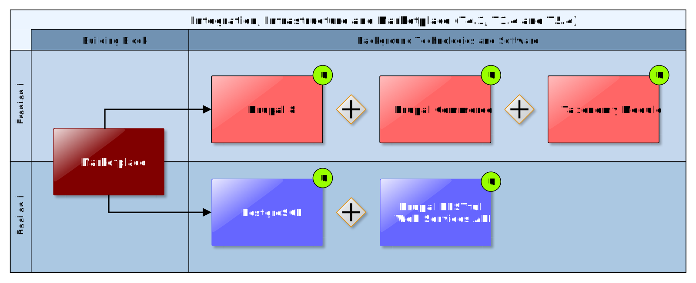

## Marketplace

The Marketplace Building Block represents a collaborative web platform where urban infrastructure or transport projects could check their climate-proof capabilities and get valuable information for decision making by the Climate Services available in the Marketplace. An infrastructure project or climate resilience manager, as a Marketplace customer, can register into the Marketplace to create and describe his infrastructure project details, and even provide related data to ease being evaluated. Also being part of the Marketplace could allow a customer to access different services and/or data provided by other Marketplace users. Other users can register into the Marketplace as data or service (human/software) providers by describing each service or data set metadata within a personal services portfolio. A 'matchmaking' functionality available in the Marketplace enables customers to find suitable Expert Climate Services (e.g. tailored advisory services) and relevant climate data and ICT Climate Services (e.g. software) available in the Marketplace to be used as inputs on the EU-GL compliant workflow provided by CSIS in order to find available adaptation measures that could minimise the impact on the infrastructures under study. This defines the Marketplace meeting point where infrastructure project managers, climate experts and climate data and services providers can meet and communicate to collaborate on assessing about climate impact.

### Requested functionality

Baseline requirements elicitation and the assessment of presently available Test Cases have yielded the following functional requirements for this Building Block:

**Baseline functionality**

  - Public Service Provider Catalogue
    
      - service provider profiles signals professionalism, reputation and trustworthiness
    
      - links to clients and case studies (demonstrators)
    
      - portfolio with links to Expert Climate Services
    
      - rich set of meta-data for matchmaking and discovery functionality

  - Public Expert Climate Services Catalogue
    
      - clear and detailed description (in relation to CLARITY Methodology) of the (tailored) Expert Climate Services including information on costs (rough estimate)
    
      - may contain not only advisory, consulting, modelling, development, ... services but also local data
    
      - associated with a Service Provider Portfolio
    
      - rich set of meta-data for matchmaking and discovery functionality

  - Customer Inquiries
    
      - user can create private inquiries
    
      - inquiries are only visible to registered providers. (business model: buy subscription to see inquiries)
    
      - an "order list" can be generated by expert workflow tool ("Scenario Management") as simple requirements specification for an Expert Climate Service

  - Expert Offer
    
      - provider can make an offer, provide a contract specification, etc.
    
      - provider can request access to the user's workspace in expert workflow tool, e.g. down- or upload data
    
      - offers are (easily) comparable since the must follow the requirements specification

**Functionality requested by CSIS Test Cases**

  - from \[TC-CSIS-0030\]: The Marketplace needs to access and show user profile information that is stored in the common user data catalogue (expectedly the PostgreSQL Drupal back-end). If the Drupal Backend DB is separate Docker instance, the Marketplace Building Block can possibility (read-only) access this database directly.

  - from \[TC-CSIS-0030\]: The Marketplace Building Block has also to offer some APIs that enables other Building Blocks like Scenario Management to access and interact with service portfolios, e.g. to search for specific Climate Service types (sectoral, spatial, etc.) and for the purpose of matchmaking (proposing fitting Expert Climate Service to users during Climate Adaptation Study).

  - from TC-CSIS-0031: Either the Marketplace Building Block or the UI Integration Platform should enable the Climate Service Provider to create and manage its detailed supplier profile.

**Functionality requested by DC Test Cases**

  - from TC DC1: The request (specification) to perform alternate (adaptation) scenarios for scenario comparison created by the Scenario Management Building Block can optionally be added as "customer inquiry" to the Marketplace so that Climate Service Providers (Experts) can make an offer through the Marketplace.

  - from TC DC1: The Marketplace must provide the possibility fora user to order an expert service for running an urban climate model (e.g. MUKLIMO 3) and to request the model output in a standardised format (e.g. NetCDF) that is supported by the CLARITY CSIS.

  - from TC DC1: The Marketplace has furthermore to support the user in ordering data needed as input or a specific model, if the data cannot be provided by the user and the data is not available for free in the Catalogue of Data Sources and Simulation Models.

  - from TC DC4: The Marketplace must provide a way for a user to contact a Climate Broker. Additionally, the Climate Broker will need to get the parameters of the request received and send the results (or notify) to the end user. The Climate Broker should also be listed on the Marketplace.

  - from TC DC4: The Marketplace Building Block provides the possibility to assign an assessment to a Climate Broker.

  - from TC DC4 010: The Marketplace Building Block is used to store and publish standardised order specifications from end users (Climate Service Customer) that can be used by Climate Brokers (Climate Service Suppliers) to prepare an individual offer for a tailored Expert Climate Service (e.g. generate local data with urban climate model).

  - from TC DC4 010: The Climate Broker (Climate Service Supplier) receives the request to perform an assessment from an end user and communicate with them.

### Exploitation Requirements assessment

The assessment of the Exploitation Requirements \[11\] identified the following concrete technical and functional implications on this Building Block:

  - from "Demonstrate and communicate the (co-)benefits of Climate Services": clearly advertise benefits for end users and dissemination experts should formulate and communicate these benefits, e.g. in form of online presentations and infographics (<http://www.visualisingdata.com/resources>)

  - from "Demonstrate and communicate the (co-)benefits of Climate Services": IT infrastructure and technology support as well as a Marketplace for Expert Climate Services is needed in the CSIS so that it is also beneficial for external Climate Service Providers to offer/provide their tailored Climate Service on the CLARITY CSIS.

  - from "Establish trust in Climate Services and their providers": Climate Service providers must disclose information on which data or methods they used to develop their Climate Service and how they dealt with uncertainties. This relates mainly to the Climate Service Provider Portfolios in the Service Catalogue / Marketplace

  - from "Co-design Climate Services engaging a community of users, providers, purveyors and researchers": integrate with the CLARITY community and the Marketplace be able to involve also new stakeholders (e.g. data providers) during all phases of the co-design process

  - from "Offer commercial fit-for-purpose tailored services targeting specific sectors and user groups": Technical specifications include for example an Information Model for Expert Climate Services that clearly defines the service level agreements and that can be related to elements of a Climate Service Providers Service Portfolio or a Service Catalogue in the CLARITY Marketplace.

  - from "Offer commercial fit-for-purpose tailored services targeting specific sectors and user groups": Easy technical facilities for external data and service providers to join the CLARITY Community & Marketplace and to offer their Climate Services must be provided. This includes for example functionalities for creating Service Provider Profiles and Service Portfolios and to link them with other relevant information available in the CSIS. Thereby, rich meta-information is important to describe providers and services and to put into regional and sectoral context.

### Technology support

Figure 39 gives an overview on the technological possibilities and the related open-source backend software components that have been selected for the Technology Support Plan.

Figure 39: Marketplace Technology Support

A content management system (CMS) provides a reliable starting point for a Marketplace like web portal, and specifically **Drupal** (see 7.5.2) being open source (under GNU/GPL license) looks as a suitable option to develop the CLARITY Marketplace. It is widely used and has lots of modules extending its capabilities and also has a large developer community. One of those modules is **Drupal Commerce** providing shopping cart and different payment methods are supported, also subscriptions and recurring payments, sell file downloads, invoice generation and email notifications as well as sale reports. All this could be useful for a Marketplace like web portal where Climate Services Suppliers will interact with infrastructure project managers.

<https://www.drupal.org/project/commerce>

Drupal also provides a robust user management and login system allowing different privileges for different users. Mainly there will be customers (project managers and climate resilience managers) and suppliers (climate expert advisors or climate data or software services providers). It will be useful to define different kind of permissions depending on the data that a customer can access or the infrastructure projects a climate services provider can access should be restricted and controlled. Drupal website contents can be classified by using **taxonomies** and also assign contents to the appropriate users in the system, this allows definition of climate infrastructure project and providers climate services portfolios and its metadata.

<https://www.drupal.org/docs/7/organizing-content-with-taxonomies/organizing-content-with-taxonomy>

Drupal also provides search functionalities that can ease the discovery of services for the different customers looking for data or advice within the CLARITY Marketplace. In the same way a messaging system can be defined to ease collaboration between different users and tasks can be assigned to different users, even a task status can be set to allow an appropriate infrastructure climate project management. Drupal works with templates and **PHP** to allow data management with MySQL or **PostgreSQL**, indeed there are **Docker** images on the Docker Store to ease Drupal deployment into a Docker container with all the required components as described in chapter 7.5.2. Drupal works against a PHP endpoint under an Apache web server where all PHP requests are received and then interactions with Drupal database model can happen, but also data in the database model can be accessed directly through a direct database connection or a **RESTful API**. Integration with JavaScript Frameworks like **Angular** and **React** could be done as already seen in the UI Integration Platform Building Block (see 7.5), there are three different choices and the combination of CMS-based approach and JavaScript Framework-based approach seems to be the most suitable approach for CLARITY Marketplace.