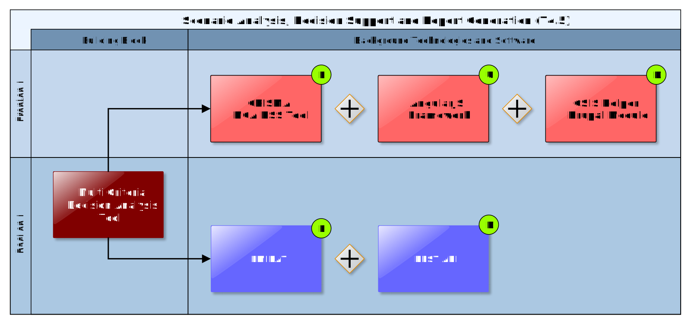

## Multi Criteria Decision Analysis Tool

The Multi Criteria Decision Analysis Tool supports the analysis and comparison of (adaptation) scenarios regarding performance indicators that can be defined by the end user and thus leverages what-if decision support to investigate the effects of adaptation measures and risk reduction options in the specific project context, and allows the comparison of alternative strategies. Thereby the tool provides multi-criteria ranking functions to compare and rank different scenarios and corresponding adaptation plans according to different criteria and their relative weight and level of importance.

### Requested functionality

Baseline requirements elicitation and the assessment of presently available Test Cases have yielded the following functional requirements for this Building Block:

**Baseline functionality**

  - a highly interactive and user-friendly decision support tool

  - supports state of the art Multi-Criteria Decision Analysis (MCDA) methods

  - helps the decision maker and strategic planner to perform multi-criteria ranking of scenarios

  - compares Indicators (quantity) derived (e.g. aggregated by an expert-provided Indicator Function) from complex and usually not easily comparable scenario data (e.g. outputs of impact models)

  - compares Criteria (quality) derived from Indicators by defining a level of satisfaction for each Indicator (qualification)

  - performs ranking of scenarios with respect to a user-defined decision strategy (e.g. Ordered Weighted Averages)

  - implements different weighting strategies

**Functionality requested by DC Test Cases**

  - from TC DC1: This Building Block should allow the following: 1. selection of the "weight" of predefined performance criteria (e.g. cost, avoided impacts, other co-benefits, etc.); 2. ranking of alternative scenarios following the selected criteria.

  - from TC DC4 080: The Multi-Criteria-Analysis Decision Support Tool is used to help the user on decision making based on standardised indicators derived from impact scenario data.

### Exploitation Requirements assessment

The assessment of the Exploitation Requirements \[11\] identified the following concrete technical and functional implications on this Building Block:

  - from "Establish trust in Climate Services and their providers": Uncertainty should be quantifiable, e.g. derived from statistical properties. Then, uncertainty could be considered as an indicator that can be transformed (normalised) to criteria. This way, uncertainty could be incorporated into Multi Criteria Analysis.

  - from "Follow a multi-sectoral approach that crosses the boundary of climate sciences": Depending on the type of project as well as the sector and fields of interest of end users, the importance of different parameters will vary. E.g. For most project managers, financial parameters/indicators and information will be of higher interest, than climatic indicators and information by itself, while end users with a focus on risk assessment in order to keep people save will value indicators about the occurrence and intensity of climate related hazards higher, than financial parameters. In order to provide pinpointed information for all relevant parties, it must be ensured that the results and provided information suits their respective needs. If there is the need to rank different scenarios, this could be e.g. done by implementing a weighing system for indicators (automatic per type of end user or end users set the weighting factors according to their preferences) for the Multi Criteria Analysis. With indicators, being part of the results provided to end users, those indicators must address all possible questions related to Climate Services end users might have. Therefore, indicators need to cover a wide variety of topics (climate, air quality, financial, social, etc.).

  - from "Use, define and promote open standards for data and services": A simple (KISS principle) standardised format for Indicators that are relevant for the Multi Criteria Decision Analysis must be defined. Technically, (impact) model output must be transformed (e.g. by an aggregation or Indicator Function) into a standardised Indicator Set so that the Indicators can easily be compared or visualised by the respective tools.

### Technology support

Figure 29 gives an overview on the technological possibilities and the related open-source frontend and backend software components that have been selected for the Technology Support Plan.

Figure 29: Multi Criteria Decision Analysis Tool Technology Support

As described in Annex 1, the **Multi Criteria Decision Analysis (MCDA) Tools** (<https://github.com/crismaproject>) of the CRISMA project (<https://crisma-cat.ait.ac.at/>) are developed as open-source **HTML5/AJAX** widgets which makes them directly usable as generic ICT Climate Services. They rely on a simple standardised **JSON** (JavaScript Object Notation) data format which fits perfectly into CLARITY’s data driven approach and, in combination with the **RESTful API** deployed on top of a **PostgreSQL** database, is also compatible with the Integration RDBMS (7.3) backend of the Scenario Management (4.3) and UI Integration Platform (7.5) Building Blocks, respectively.

<https://www.json.org/>

As the CRISMA tools have been implemented on basis of the **AngularJS** 1.0 JavaScript framework, it must be noted, that version 1.0 has been superseded by **Angular** 5.0 in 2017 and version 1.0 reached end of life in 2016. Although AngularJS 1.0 is still actively maintained by the community on GitHub (<https://github.com/angular/angular.js/>), no new plugins and libraries are being developed for version 1.0 and existing libraries and plugins don’t receive new feature or security updates for AngularJS 1.0 in most cases.

<https://angularjs.org/>

Depending on additional functionality that is requested for the Multi Criteria Decision Analysis Tool, it might therefore be necessary to base further developments of the tool on more recent JavaScript Frameworks like **Angular 6.0** or **React 16.0**. A detailed discussion of this topic can be found in the description of the planned usage of the CRISMA Multi Criteria Decision Analysis Tool in in Annex 1.