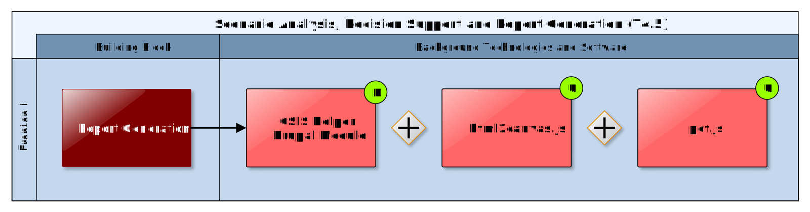

## Report Generation

The result of a climate adaptation study is a report that could be (semi-)automatically generated. Report Generation should enable the user to easily access and download draft and final reports packages at the end of the project assessment process. Such report packages should include automatically generated documentation (with embedded supporting tables, graphs and maps of the area under study) along with all the datasets (Data Package, see 4.2) used in the study. In this way, the packages generated can be further used in other stages of the planning project.

The (semi-)automatic Report Generation depends on well-defined inputs that can be validated, aggregated and visualised. Therefore, technical standards for the respective input formats must be adopted by CLARITY Data Packages and communicated to external stakeholders that want to use the CLARITY Report Generation functionality for their Expert Climate Services.

### Requested functionality

Baseline requirements elicitation and the assessment of presently available Test Cases have yielded the following functional requirements for this Building Block:

**Baseline functionality**

  - The Report Generation component must be able to produce downloadable PDF files.

  - The component will be able to access information of the case study, and export this information to a dedicated document.

  - The component must be able to include both text and graphical information available for the study.

**Functionality requested by CSIS Test Cases**

  - from US-CSIS-100: The Report Generation Component should be automatically generated based on the available data and users' decisions. This must be a credible report so that it can be added to project documentation

  - from US-CSIS-100: The report should also contain the information that is needed for auditing the decision making process later on. For example, the list of all actions, inputs, outputs and decisions.

**Functionality requested by DC Test Cases**

  - from US-DC1-100: The results of CLARITY simulations and climate services can be visualized as synthetic document (e.g. PDF with text and images.)

  - from TC DC1: The Report Generation Building Block should allow to acquire in a single document the results of the simulation and MCDA.

  - from TC DC4 090: The Report Generation Building Block can show a preliminary report with the results obtained in the project and allows for the inclusion of new information for the generation of the final report.

### Exploitation Requirements assessment

The assessment of the Exploitation Requirements \[11\] identified the following concrete technical and functional implications on this Building Block:

  - from "Follow a multi-sectoral approach that crosses the boundary of climate sciences": Besides the possibility to produce a general/summarized report which contains the most important information, the ability of Reporting Generation to produce additional extended focus reports which addresses certain sectors (climate, adaptation, financial, people, etc.) in more detail, could contribute to always providing the most valuable information to end users without overloading them with information.

  - from “Consider the role of new regulatory frameworks in stimulating the emergence of Climate Services": Simple templates for reports must be defined. This requires an assessment of regulatory frameworks and their requirements. Besides the omnipresent EU-GL, this includes for example also the methodology for tracking climate adaptation finance of Multilateral Development Banks

  - from “Consider the role of new regulatory frameworks in stimulating the emergence of Climate Services": (semi-) automatic Report Generation depends on well-defined input that can validated, aggregated and visualised. Therefore, technical standards for the respective input formats (Data Packages) must be defined and communicated to external stakeholders that want to use CLARITY Report Generation functionality for their Expert Climate Services.

  - from "Provide a user-friendly, intuitive and context-aware discovery and communication infrastructure for Climate Service": Reporting Generation should enable the user to easily access and download draft and final reports packages at the end of the project assessment process. Such report packages should include automatically generated documentation (with embedded supporting tables, graphs and maps of the study area) together with all the datasets (Data Package) used in the study in order to be further used in other stages of the planning project.

### Technology support

Figure 30 gives an overview on the technological possibilities and the related open-source frontend software components that have been selected for the Technology Support Plan.

Figure 30: Report Generation Technology Support

The Report Generation tool is meant to provide a PDF report based on the elements and results of the study done for a certain area under a set of selected conditions. This tool must have access to all the available information for the project and depending on the technology used for the Scenario Management Building Block (6.2) it may be needed to develop a middleware library to retrieve the information from the Integration RDMBS (7.3) or the Data Repository (7.4).

In terms of creating the report itself, a JavaScript library that allows for customization of charts and graphs is **eCharts**. It has a map component and the capability of allowing the user to interact with the charts generated. Being a JS library it can be easily integrated on different platforms and web applications. Both SVG and Canvas, are supported in eCharts.

<https://github.com/ecomfe/echarts>

Using both the graphs and charts generated and customized with eCharts and the text existing in the system there are several JavaScript-based libraries that can be employed for the generation of the final report, among these are: **jsPDF**, **pdf.js** or **react-js** among others. The proper choice will be determined by the ease of integration with the User Interface Integration platform.
