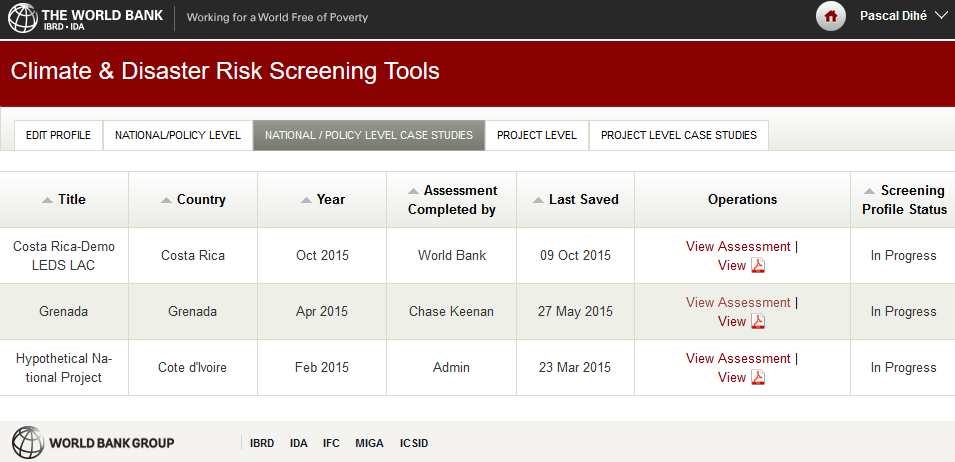

## Scenario Management

The Scenario Management Building Block supports and enforces first and foremost the standardised workflows of the EU-GL \[1\] for each of the distinct planning steps and provides respective user interfaces that guide the user through the process of co-creating a Climate Adaptation Study. Basically, the end user is presented with the list of recommended and required steps for performing a complete Climate Adaptation Study for the respective (infrastructure) project under assessment and is asked to provide the information that is needed to complete the current step and advance to the next step. If the user is by itself not able to give the needed information (e.g. detailed local hazard maps for hazard characterisation), the user can either perform a limited pre-assessment (pre-feasibility study) or obtain the required information from a suitable Expert Climate Service (e.g. generate tailored hazard maps by running local climate models) that is available from the CLARITY Marketplace (7.6).

For each of the distinct EU-GL modules or steps (Figure 20) the CSIS offers generic data-driven ICT Climate Services and Building Blocks, respectively, which are directly integrated into the Scenario Management Building Block. Additionally, there is the possibility for Climate Server Providers to develop sectoral or even site-specific ICT Climate Services that can be integrated into the Scenario Management Building Block on-demand for specific infrastructure project types, sectors or Climate Service Customers. This applies for example specifically to the non-generic aspect of Scenario Management, which is explained in the following.

Figure 20: Modules of the EU-GL as part of the overall CLARITY CSIS workflow

The second aspect of Scenario Management, the site- and use-case-specific impact scenario analysis, covers mainly the modules related to the assessment of risks and impact and the identification of adaptation options (resulting from varying impact scenarios) and is currently foreseen to be provided as tailored Expert Climate Service rather than as generic ICT Climate Services. Nevertheless, also possibilities to support Climate Service Providers in actually performing impact scenarios are discussed in section 4.1.3. Independently of that, the results of such impact scenarios, if available in a standardised format supported by CLARITY, can of course be used in further modules and the respective Building Blocks like the Map Component (5.1), the Scenario Transferability Component (5.2) and the Multi Criteria Decision Support Analysis Tool (6.1).

### Requested functionality

Baseline requirements elicitation and the assessment of presently available Test Cases have yielded the following functional requirements for this Building Block:

**Baseline functionality**

The CLARITY Description of the Actions (Annex 1 to the Grant Agreement) describes the Scenario Management Building Block as a software that “allows end-users to easily produce and manage new scenarios by editing the parameters of the pre-defined core scenarios as defined in WP1”. If applied to the an “EU-GL scenario” the baseline functionality can be summarised as to

  - manage projects and planning sessions (assessments)

  - step-by-step guide through all steps of the EU-GL modules

  - offer generic tools and (freely available) data for each step to be able to perform a pre-assessment

  - offer possibilities for tailored data and services (advice, consulting, etc.) if the generic functionality is not sufficient and a detailed assessment is required

**Functionality related to the EU-GL Workflow requested by CSIS Test Cases and User Stories:**

  - from US-CSIS-100: The Scenario Management Component supports and enforce the standardized workflows for each of the supported planning processes

  - from TC-CSIS-0052: The Scenario Management Component is responsible for the management of user projects and "planning sessions" (adaptation assessments). The Building Blocks provides the respective user interfaces and communicates with the Integration RDMBS BB to obtain the list of project types (or templates) needed for initial creation of a new project as well as the user specific workspace information that consist of concrete project instances and planning sessions.

  - from TC-CSIS-0000: The Scenario Management Component and the project management user interfaces, respectively, are either embedded (e.g. as iframe) in the UI Integration Platform (Drupal System) or directly as part of the UI Integration Platform (e.g. Drupal Module).

  - from TC-CSIS-0000: the Scenario Management Building Block should provide APIs and user interfaces to facilitate the management of the planning scenarios.

**Functionality related to the EU-GL Workflow requested by DC Test Cases and User Stories:**

  - from TC-AIT-01: The Scenario Management Component must produce the overall user interface and lead the user from one step to another.

  - from TC DC1: The Scenario Management Building Block must provide a user interface (model input data dashboard widget) for the user with the list of required input data needed for the parametrisation / calibrating of a specific (hazard) model that is executed "offline" by an expert. The user must have the possibility to upload the data or to choose existing data from his personal workspace (data dashboard) or from the CLARITY Catalogue of Data Sources and Models or Marketplace.

  - from TC DC2 P1: The Scenario Management Building Block must provide a form or questionnaire that allows the user to specify relevant information about his problem (project), such as geographic location, elements and risks, etc.

  - from TC DC4 010: The Scenario Management component should generate a formal and standardised order specification for local climate information (hazard) needed by the end user to perform the climate adaptation study. The order specification must take the temporal horizons, the resolution, the spatial extent, the needed climate (hazard) variables, the data format (NetCDF, Shape, ...) requested by the user, etc. into account. The Scenario Management puts the standardised order in the Marketplace and notifies the user, if a CS Providers have accepted the order and have made an offer.

  - from TC DC4 080: The Scenario Management component supports the user in selecting the hazards to be considered in his/her study and for each of them selects the impact scenarios to be considered.

**Functionality related to simulation scenarios requested by DC Test Cases and User Stories:**

  - from TC DC1: We are assuming here that simulation scenarios run off-line upon request of end users and are retrieved through the Scenario Management Building Block. Alternatively, the Scenario Management Building Block should allow to run simulations through web services.

  - from TC DC1: The Scenario Management Building Block must provide an user interface that will allow the user to request the creation of alternate (adaptation) scenarios for scenario comparison in the expert work flow (adaptation / no-adaptation option). This request needs to include the type of hazard/impact scenarios object of the simulation and the type of adaptation options to take into account. The supported adaptation options for a specific type of scenario are provided by the Catalogue of adaptation options.

  - from TC DC1: Scenario Management Building Block must offer a GUI that enables the end user to provide a complete specification of different (adaptation) scenarios that should be performed (off-line) by an expert.

### Exploitation Requirements assessment

The assessment of the Exploitation Requirements \[11\] identified the following concrete technical and functional implications on this Building Block:

**Implications related to the EU-GL Workflow:**

  - from "Co-design Climate Services engaging a community of users, providers, purveyors and researchers": Be based on a well-defined and well-documented process (CLARITY Modelling Methodology) so that both users and providers of Climate Services are aware of the steps of the process as well as the required input and the required output.

  - from "Establish trust in Climate Services and their providers": Users must be able to record the decisions that lead to the implementation of climate change adaptation measures and to trace them back to the underlying data and models. This relates mainly to Scenario Management.

  - from "Co-design Climate Services engaging a community of users, providers, purveyors and researchers": Be based on a well-defined and well-documented process (CLARITY Modelling Methodology) so that both users and providers of Climate Services are aware of the steps of the process as well as the required input and the required output.

  - from "Follow a multi-sectoral approach that crosses the boundary of climate sciences": As different user perspectives (depending on the sectors in which they work in) will lead to different solutions being assessed by the use of CSIS, the Scenario Management is required to be flexible enough to cope with this variety of possible solutions. This is heterogeneity challenge can only be addressed by enforcing standardised processes (CLARITY Modelling Methodology) and data formats (Data Packages).

  - from "Provide a user-friendly, intuitive and context-aware discovery and communication infrastructure for Climate Service": At each step ("module" in EU-GL terminology) the Scenario Management Building Block that actually implements the basic or expert workflow, must present information on additional suitable context-dependent and fit-for-purpose local and sectoral data or providers that are able to generate such data. This also includes of course also potential Expert Climate Services and their providers, respectively. When linked to the Marketplace such a discovery approach that recommends relevant content opens new exploitation possibilities.

  - from "Provide a user-friendly, intuitive and context-aware discovery and communication infrastructure for Climate Service": The different steps proposed by EU-GL should be presented to the user in a "story" manner, allowing him/her to go back and forth, assessing in a visual manner (i.e, maps, graphs, tables) the consequences of the decisions he/she makes in each step.

  - from "Use, define and promote open standards for data and services": The CLARITY Modelling Methodology that is developed in WP3 based on EU-GL combining the concepts of IPCC AR5 and the risk assessment community must manifest in technical specifications and concrete technical solutions (e.g. Scenario Management and CSIS) that are to be provided and co-developed in WP4 and WP1.

**Implications related to simulation scenarios:**

  - from "Provide a user-friendly, intuitive and context-aware discovery and communication infrastructure for Climate Service": ICT Climate Services that allow direct user interaction should be developed according concepts for usability and for human -computer interaction with help of state-of-the- art technologies for user interface design. This demands for modern and lightweight web applications rather than heavyweight and complex desktop applications.

### Technology support

Figure 21 gives an overview on the technological possibilities and the related open-source frontend and backend software components that have been selected for the Technology Support Plan.

Figure 21: Scenario Management Technology Support

The Technology Support Plan depicted in Figure 21 refers to the Scenario Management Building Block in its role as the overall workflow tool that guides the user through the different steps of the EU-GL methodology (see Figure 20). Accordingly, it is tightly coupled with the overall UI Integration Platform (7.5) and needs to integrate and interact with nearly all other Building Blocks of the CSIS. Therefore, the fronted part of this Building Block will be realised as **Drupal Forms** and custom **Drupal Modules**, respectively as explained in the overall user interface integration concept (7.5.2).

Interestingly, the same approach has been followed for the development of the **World Bank’s Climate and Disaster Risk Screening Tools**: They use same technology (**Drupal** and custom **Modules**) as planned to be used for the Scenario Management Building Block.

<https://climatescreeningtools.worldbank.org/about-the-tools>

Although the scope of the World Bank tools is limited to pre-feasibility analysis (“self-assessment”), which covers only a small part of the overall EU-GL methodology and thus also the CLARITY Scenario Management Building Block, the general process of screening and assessing a project for climate risk is the same in the main. Thereby, it serves not only for confirming the technical feasibly of the Technology Support Plan for Scenario Management in CLARITY, it is also basis for discussion with potential end users. Figure 21 shows a screen shot of World Bank tools’ project assessment and case studies dashboard and thus an example how the CLARITY Scenario Management could look like.

Figure 22: World Bank Climate and Disaster Risk Screening Tools

Regarding the backend of the Scenario Management, the **cids Integration Base**, which serves also as backend of the SUDPLAN Scenario Man agent System (Annex 1) can be used. Since the Integration Base builds upon the same technology as the Integration RDBMS (7.3) is also a compatible Drupal backend database.

<https://www.cismet.de/cidsReadme.html>

Moreover, an additional **RESTful web services API** must be provided to allow also Building Blocks that are not implemented as Drupal Component (Module, Form, …) to communicate securely and transparently with the backend database. For this purpose, either the new RESTful Web Services API offered by **Drupal 8**, or an extension of the **cids RESTful API** can be used. A choice for one approach depends on technical and functional requirements of the respective Building Blocks.

<https://www.drupal.org/docs/8/api/restful-web-services-api/>

While the first part of the Technology Support Plan for the Scenario Management Building Block focused on functionalities for end users (Climate Service Customers), the second part discusses possibilities for supporting also Climate Service Suppliers in the provision of Expert Climate Services related to impact scenario analysis. In the original work plan, the **SUPDLAN Scenario Management System** (Annex 1) is foreseen to cover this task.

<http://sudplan.eu/results>

However, it must be admitted, that the whole field of simulation model and data integration in the context of impact scenario analysis poses several non-trivial yet only partially resolved problems. Currently, ICT is still far from being able providing a fully automated solution that can solve the integration challenge and to offer a generic scenario management system that is able to conduct arbitrary simulations at the click of a button.

Therefore, a common approach that has also been followed in the SUDPLAN (<http://www.sudplan.eu/>) and CRISMA (<http://www.crismaproject.eu/>) projects is to provide a toolkit or framework for the actual development of such an expert system for simulation management. Such a toolkit offers a set of composable and generic **Building Blocks**, which can be integrated and assembled together with local and heterogeneous data and models into complex applications. In principle, the same approach is also applied in CLARITY when ICT and Expert Climate Services are co-developed with help of Building Blocks provided by WP4 “Technology Support” (see section 1.2). Most toolkit approaches rely upon interoperability standards for data exchange and model integration, most notably the standards of the Open Geospatial Consortium (OGC) as used also in the SUDPLAN Scenario Management System’s “**Model as Service Integration**” Building Bock (Annex 1). Again, this is very similar to CLARITY’s data driven approach that expects generic ICT Climate Services to rely on standardised data formats.

<http://sudplan.eu/results>

In reality, local data is not always available in the standardised format expected by the tools offered by a simulation management system toolkit. Moreover, syntactical and semantic description (meta-data) of the data is often not available in a formal description that can be used for (semi-) automatic integration. Admittedly, there is no generic solution for data and model integration and thus no scenario management system without additional development and integration activities. Simulation Management for climate, impact or adaptation scenarios that require calibration and execution of local climate, hazard, and impact models involves therefore for each distinct project under assessment a certain amount of tailoring and customisation. Technology support can be provided, as for example in form of a Framework like the SUDPLAN SMS, to support this process on the Climate Service Provider side, but in the end it always boils down to custom integration and development. CLARITY’s data-driven approach here is to formalise this process and to select and specify the interoperability standards at the level of the CSIS so that Climate Service Provider are encouraged to deliver the results of their impact scenario analyses in respective format. To this end, no “one size fits all” technical solution can be provided for the management, execution and evaluation of impact scenarios but a set of tools, methodologies, standards and best practices that support Climate Service Suppliers in the provision of tailored Expert Climate Services.