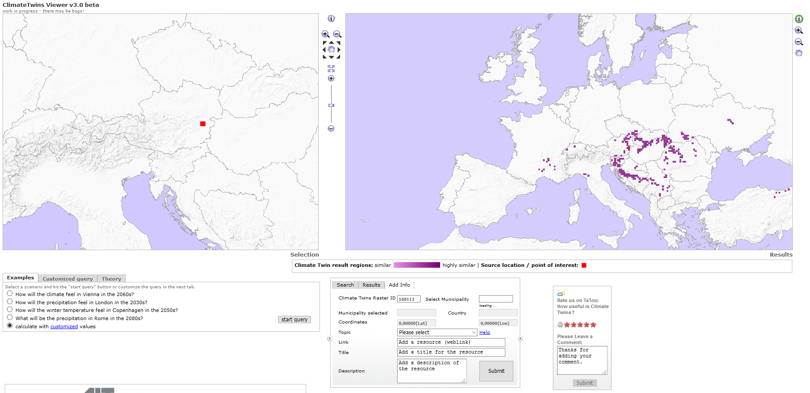

## Scenario Transferability Component

There are two main usage scenarios for the Scenario Transferability Component: Providing general matchmaking functionality by means of "Smart Links" (REST API) and side-by-side (visual) comparison of alternate (adaptation) scenarios (graphical user interface):

**Matchmaking**

In the first usage scenario, the Scenario Transferability Component is used for discovery and matchmaking of related entities like scenarios, projects, elements at risk, adaptation options, etc. For example, applied to the Catalogue of Elements at Risk and Adaptation Options (3.1), infrastructure projects being assessed by end users can be matched to other projects that share the same elements at risk (covering a variety of sectors). The same could be true for adaptation options or adaptation Scenarios. Moreover, end users could discover other projects with the same proposed or already implemented adaptation options, in order to investigate further and learn from the experiences already made.

The Scenario Transferability Component should also be used to match the offer of Expert Climate Services that are described in Marketplace (7.6) as part of a Climate Service Provider's Service Portfolio against the demand of the users, e.g. when performing a Climate Adaptation Study. Moreover, the Transferability Component should also provide links to partner portals like Climate-ADAPT ([http://climate-adapt.eea.europa.eu/http://climate-adapt.eea.europa.eu/](http://climate-adapt.eea.europa.eu/)) or Upstream Climate Services like SWICCA (<http://swicca.climate.copernicus.eu/>).<http://swicca.climate.copernicus.eu/>). Thereby, contextual information (e.g. spatial location, climate hazard, sector, etc.)...) should also be used (e.g. by means of HTTP GET parameters or deep links) to direct the user to relevant information (e.g. guidance documents) and data (provenance).

**Scenario Analysis and Comparison**

In the second usage scenario, the Scenario Transferability Component is used for (visual) scenario analysis and comparison. Thereby, it allows the side-by-side comparison not only of different climate scenarios (Climate Twins Concepts), but also the comparison of alternate adaptation scenarios resulting from Impact Scenario Analysis as described in EU-GL Module 4 "Assess Risks and Impact" and in chapter 3.3 "Risk Assessment and Impact Scenario Analysis" of D3.1 \[7\]. To support a generic comparison of arbitrary impact scenarios, the Scenario Transferability Component relies on standardised data formats for aggregated scenario data (indicators) in JSON/CSV format and spatial data (maps) in OGC format. The Component supports decision making by visualising the key performance indicators (e.g. operation duration, number of evacuated citizens, number of deaths, value of lost property, value of lost productivity, price of mitigation actions, etc.) as tables, diagrams or maps.

### Requested functionality

Baseline requirements elicitation and the assessment of presently available Test Cases have yielded the following functional requirements for this Building Block:

**Baseline functionality related to “Matchmaking”**

  - describe a relationship between different entities and that can be enriched with additional metadata

  - connected case studies (CLARITY Demonstration Cases) via “Smart Links” to product portfolios of Climate Service Providers as well as to the underlying data and models and their provenance metadata

  - provide references to external information sources (documentation, papers, websites, etc.).

  - Climate Twins matrix should not only to be based on climate (false-positive aspect of climate change: it's getting warmer) but also on sectoral impact (negative effects)

**Functionality requested by CSIS Test Cases related to “Matchmaking”**

  - support for “Smart Links” that describe a relationship between different entities and that can be enriched with additional metadata

  - connected case studies (CLARITY Demonstration Cases) via “Smart Links” to product portfolios of Climate Service Providers as well as to the underlying data and models and their provenance metadata

  - provide references to external information sources (documentation, papers, websites, etc.).

  - Climate Twins matrix should not only to be based on climate (false-positive aspect of climate change: it's getting warmer) but also on sectoral impact (negative effects)

**Functionality related to “Matchmaking” requested by DC Test Cases**

  - from TC DC1: The Scenario Transferability Component could be used for matchmaking functionality: If the user is in need of a specific hazard map (input: hazard type) for a specification location (input: spatial location) and resolution, the Scenario Transferability Component could query the Catalogue of Data Sources & Models the Marketplace and then and propose a) a local (climate / geophysical / ....) model that is able to generate such a hazard map, b) a list of required input data types (models needs a DEM, model needs cordex climate data, ....) by the model, c) a list of potential data sources that are available for free and for sale and c) CS providers that are able to produce the hazard maps "offline".

**Baseline functionality related to “Scenario Analysis and Comparison”**

  - Comparison of extreme heat event indicators (e.g. tropical nights, summer days/heat days, Kisely index) based on 10 year time slice (decadal) data provided by SMHI.

  - Comparison of wind speed patterns based on 10 year time slice (decadal) data provided by SMHI.

  - Comparison of extreme precipitation patterns based on 10 year time slice (decadal) data provided by SMHI.

  - Display of frequency pattern result maps.

**Functionality related to Scenario Analysis and Comparison requested by DC Test Cases**

  - from TC DC1: Display results of the map (no adaptation) in a table format (needs to be displayed together with the map results)

### Exploitation Requirements assessment

The assessment of the Exploitation Requirements \[11\] identified the following concrete technical and functional implications on this Building Block:

  - from "Demonstrate and communicate the (co-)benefits of Climate Services": The implementation of the Demonstration Cases must follow a common methodology that is supported by tools (ICT Climate Services) that are able to generate data-driven insights, e.g. in the form of (standardised) indicators that can be easily visualised (chart, diagram.)

  - from "Follow a multi-sectoral approach that crosses the boundary of climate sciences": The scope of the Scenario Transferability concept could be extended beyond basic climate indicators so that end users could also discover “twin” regions within other sectors e.g. where the probability of certain hazards is similar to their actual project region. Furthermore, the Scenario Transferability concept could also be applied to the Catalogue of elements at risk and adaptation options so that the end users project being assessed can be matched to other projects that share the same elements at risk (covering a variety of sectors). The same could be true for adaptation options. By the use of Scenario Transferability, end users can search for and find other projects with the same proposed or already implemented adaptation options, in order to investigate further and learn from the experiences already made.

  - from "Provide a user-friendly, intuitive and context-aware discovery and communication infrastructure for Climate Service": Discovery and matchmaking (Scenario Transferability) should not be limited to the CSIS (Marketplace) but also provide links to partner portals like Climate-ADAPT (<http://climate-adapt.eea.europa.eu/>) or Upstream Climate Services like SWICCA (<http://swicca.climate.copernicus.eu/>). Thereby, contextual information (e.g. spatial location, climate hazard, sector, ...) should also be used (e.g. by means of HTTP GET parameters or deep links) to direct the user to relevant information (e.g. guidance documents) and data (provenance).

### Technology support

Figure 26 gives an overview on the technological possibilities and the related open-source frontend and backend software components that have been selected for the Technology Support Plan.

Figure 26: Scenario Transferability Component Technology Support

The original Climate Twins prototype (Annex 1) was based on the following components:

The back end consists of a **PostrgreSQL** relational database running the **PostGIS** extension (see 7.3.2). The database holds the climate comparison matrices derived from AIT’s climate simulation runs analysing data from the **COSMO-CLM (COnsortium for Small-scale MOdelling - Climate Local Model)** model which had been embedded into the ECHAM5/MPIOM global model. The model results are climate data on an hourly basis from 1960 to 2100 in a raster with a resolution of 0.165 (approx. 18 to 20 km).

The front end is using a (at that time Adobe Flash© based) Map Viewer (**FlamingoViewer**). The viewer is visualising the results of the Climate Twins request via WMS maps served by an **UMN Mapserver** instance running on the same server.

<https://github.com/flamingo-geocms/flamingo/wiki>

<https://en.wikipedia.org/wiki/Adobe_Flash>

<http://mapserver.org/>

Since the above technologies (Adobe Flash© and UMN MapServer) can be considered rather outdated, it is not feasible to re-use them within CLARITY. We will therefore focus on the re-use of the data base matrices and the comparison algorithms used within the Climate Twins application and serve the results via a RESTful web service e.g.

Figure 27: Climate Twins Prototype Web Application