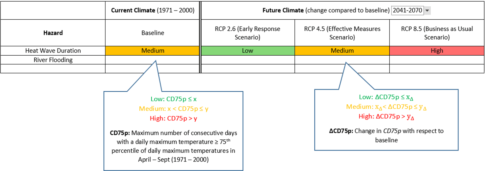
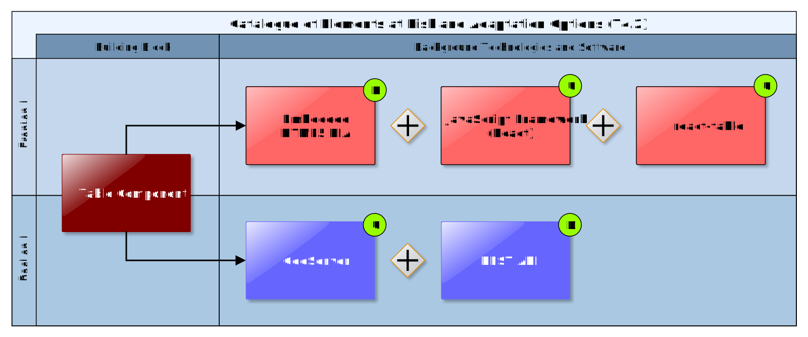

## Table Component

The Table Component is a reusable and configurable Building Block for the tabular visualisation of Hazard, Exposure, Vulnerability and Impact Data. The table shows aggregated and normalised values for respective Hazards, Elements at Risk, etc. relative to the selected study area. Aggregation and normalisation of data is not performed by the Table Component itself, but by separate web services that transform the original data to standardised JSON format supported by the Table Component.

Figure 24: Table Component Mock-Up

### Requested functionality

Requirements elicitation and the assessment of Mock-Ups have yielded the following functional requirements for this Building Block:

  - Show aggregated and normalised (low, medium, high) hazard indexes for the the baseline (past / current climate) period for a specified geographic region (study area)
  
  - Show aggregated information on elements at risk for a specified geographic region (study area)
  
  - Show aggregated information on elements at risk grouped by vulnerability classes for a specified geographic region (study area)
  
  - Show information regarding the number of elements at risk impacted by hazard and grouped by damage classification for a specified geographic region (study area)
	
### Technology support

Figure 24 gives an overview on the technological possibilities and the related open-source frontend and backend software components that have been selected for the Technology Support Plan.

Figure 24: Map Component Technology Support

The high interactivity and flexibility expected from this component requires an approach based on responsive and highly adaptable technologies. This approach can be achieved using client-side rendering along with libraries and tools that have already proved their usability and popularity, meaning that a big and active community is supporting their development and use. To ensure this high interactivity approach of this web application a good approach would be to use **React**, React allows rich site interactions, fast website rendering after the initial load, and a good selection of JavaScript libraries. It is also designed to build encapsulated components that can be composed to make complex UIs. In consequence, the Table Component is developed as independent **HTML5/AJAX RIA** that is loosely embedded with help of the **ReactMount** Drupal Module in the UI Integration Platform (**Drupal 8**) and relies as backend on Data Repository and various OGC Services, respectively. In terms of an open-source solution for the table itself, **react-table**, a lightweight, fast and extendable datagrid built for React, will be used for the implementation.