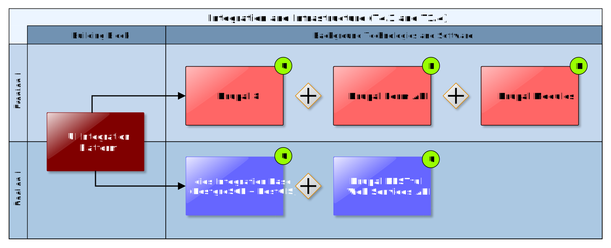

## UI Integration Platform

CLARITY's common User Interface Integration Platform is the unified entry point to the CSIS (<http://www.myclimateservice.eu/>). It integrates the different frontends (user interfaces) of CLARITY Building Blocks and ICT Climate Services, respectively, with the Climate Services Marketplace (7.6) and the demonstrator showcases and promotes Expert Climate Services. The UI Integration Platform must combine different independently developed interactive JavaScript/HTML5 applications into a common user interface that acts and looks more like one integrated Rich Internet Application (RIA) rather than a portal or website. Moreover, the different Building Blocks to be integrated may potentially use different technologies such as pure client-side HTML5/AJAX technologies (Angular, React, ...), server-side technologies (Servlets, Java Server Pages, PHP) or even a mixture of both. The reason for this need comes not only from the fact, that the Building Blocks are developed by different CLARITY partners, but also from the necessity to maximise the re-use of existing components (catalogue, map viewer, e-commerce engine, ...), etc. Thereby, the UI Integration Platform should also provide some basic functionality (user management, per-user customisation, user workspace, etc.) out-of-the box, to let developers concentrate on the development of functionalities actually requested by end users.

### Requested functionality

Baseline requirements elicitation and the assessment of presently available Test Cases have yielded the following functional requirements for this Building Block:

**Baseline functionality**

  - host independently developed Building Block UIs (RIAs - rich internet applications, widgets, portlets, etc.)

  - non-intrusiveness: the constraints imposed on the development of Building Block UIs that enable them to participate in the platform must be kept a at minimum. Ideally, it should be possible to wrap an independently developed RIA into a widget/portlet/etc. complainant to the specification of the platform with minimal effort.

  - user management and customization options with (optional) user authentication and authorization. To lower the entry hurdle registration must remain optional at the cost of limited functionality for unregistered users - the usual portal / CMS features like extensibility, high performance, scalability, security management, support for mobile devices

  - user interface design guidelines and default layout specifications (CSS files) should be provided

**Functionality requested by CSIS Test Cases**

  - from TC-CSIS-0000: The Scenario Management Component and the project management user interfaces, respectively, are either embedded (e.g. as iframe) in the UI Integration Platform (Drupal System) or directly as part of the UI Integration Platform (e.g. Drupal Module or View).

  - from TC-CSIS-0900: The UI Integration Platform should provide a button to the end-user to start the Data Package Export Wizard, which will automatically compile and present to the user the data used so far in the study while at the same time presenting to him a form to enable him to indicate further sources of information that needs to be included.

  - from TC-CSIS-0010: The UI Integration Platform (Drupal 8) provides all user profile management facilitates (registration, login, approval, ....) and especially support for custom user profile types, or at least roles: end users ("buyer" = project planner, climate resilience manager) and provider ("seller", "expert" = CS or data provider / purveyor).

  - from TC-CSIS-0031: Either the Marketplace Building Block or the UI Integration Platform should enable the CS provider to create and manage its detailed service portfolio. Also search for specific Climate Service types (sectoral, spatial, etc.) and for the purpose of matchmaking (proposing fitting Expert CS to users during Climate Adaptation Study).

  - from TC-CSIS-0010 : The UI Integration Platform (Drupal 8) has also to offer some APIs that enables other Building Blocks like the Marketplace to access and interact with the user profiles. e.g. to search for specific user types (sectoral, spatial, etc.) for the purpose of matchmaking (finding a suitable "Expert").

**Functionality requested by DC Test Cases**

  - from TC DC1: The UI Integration Platform must provide the possibility for user and expert to exchange context-specific messages through the CSIS, e.g. by creating comments, question and answers.

### Technology support

Figure 38 gives an overview on the technological possibilities and the related open-source frontend and backend software components that have been selected for the Technology Support Plan.

Figure 38: UI Integration Platform Technology Support

Since the UI Integration Platform is a central components that needs to integrate all Building Blocks of the CSIS Architecture (2.1), three different approaches towards technology support have been evaluated:

1)  **Portal-based approach  
    **Choose a technological platform that acts like a portal or mashup platform whereby existing components (CLARITY Building Blocks developed as widgets or portlets) are combined into one integrated Rich Internet Application. Ideally this also allows the use of third-party components that comply with a certain standard (e.g. Java Portlet Specification) supported by the technological platform. The advantages of this approach are, that potentially also different technologies (Java Portlets and HTML5/JS widgets) could be combined in one platform and that the platform also provides rich functionality (events, inter-component-communication, data storage, user and permission management, user profiles, logging, ...) that can be used by the integrated components (e.g. by calling the a REST web service or JavaScript API that is provided by the platform). The main disadvantage may be, that complexity and restrictions imposed on the components could complicate or the delay their development. In addition, the maintenance and installation effort should not be underestimated. An example for such a platform is Liferay (<https://www.liferay.com/>).

2)  **CMS-based approach**  
    Choose a content management system (CMS) and integrate the CLARITY Building Blocks either as independent HTML5/JS widgets (if possible) or develop CLARITY Building Blocks as CMS-specific modules. This approach is similar to the portal-based approach, also regarding advantages and disadvantages. Though, there is an important differences. A CMS is generally based on a thin client architecture whereby the majority of business logic resides on the server-side and many synchronous server request result in a full reload of the website when it's content changes. A modern Rich Internet Application follows generally a thick client architecture whereby a large part of the business logic resides on client-side (JavaScript) and asynchronous server requests (AJAX) lead to no page reload at all. Therefore such a web application is also called Single Page Application (SPA). The possibilities for integrating SPAs into a CMS or a making a CMS behave like a SPA may thus be limited. Examples for popular CMS are Drupal (<https://www.drupal.org/>) and WordpPress (<https://wordpress.com/>).

3)  **JavaScript Framework-based approach  
    **Agree on one client-side JavaScript Framework and choose a common boilerplate or template project ("dashboard") that is the outline or frame where the unified components (e.g. CLARITY Building Blocks developed as NPM (Node Package Manager) modules) are combined into one Single Page Application. Consequently, all developers of UI Building Block must use the same JavaScript Framework as the UI Integration Platform. The main advantage is the flexibility in developing the single components and their coherent appearance, layout and behaviour. The disadvantage is that no other Single Page Application can be integrated easily (probably only as iframe), though the usage of common JavaScript libraries (e.g. leaflet.js) is nevertheless possible. Another disadvantage is that common base functionality for user management, etc. has possibly to be developed from scratch. There are, however, also existing libraries that can be used for that purpose. Examples for such frameworks are React (<https://reactjs.org/>) or Angular (<https://angular.io/>).

Based on the expertise available in the CLARITY consortium, the requested functionality both on the UI Integration Platform and integrated Building Blocks as well as the availability of background technologies and software, the CLARITY technology support team decided to follow a combination of the CMS and JavaScript Framework-based approach:

The powerful CMS **Drupal 8** is used as the overall UI Integration Platform. Drupal is for example also used for CLARITY’s coordination platform ([https://cat.clarityCLARITY-h2020.eu/](https://cat.clarity-h2020.eu/)) and the Worldbank’s Climate and Disaster Risk Screening Tools (<https://climatescreeningtools.worldbank.org/>).

<https://www.drupal.org/about>

New Building Block user interfaces (frontends) can be developed in the **PHP** programming language as **Drupal Modules** and/or with help of the **Drupal Form API**. This applies for example to the Data Dashboard Building Block (4.1).

<https://secure.php.net/manual/en/preface.php>

Some Building Blocks that are based on existing background software and technologies like the Multi Criteria Decision Analysis Tool (6.1) or the Map Component (5.1) will be provided as **HTML5/AJAX RIAs**. They can be embedded as HTML **iframe** into the UI Integration Platform.

<https://www.w3.org/TR/html5/semantics-embedded-content.html#the-iframe-element>

Communication with the Integration RMBMS (7.3) which serves as the backend of the UI Integration Platform is then performed with help of a **RESTful Web Services API**.

<https://en.wikipedia.org/wiki/Representational_state_transfer>